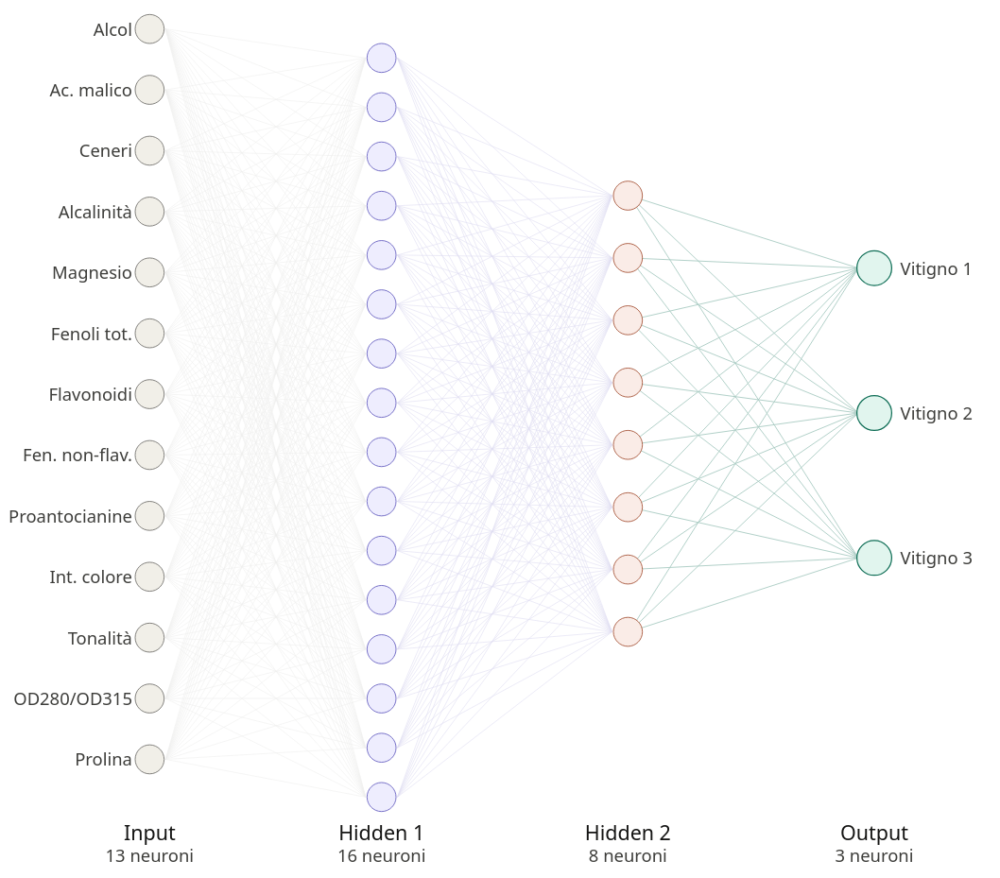

```{=html}
<script>
document.addEventListener("DOMContentLoaded", () => {
  const banner = document.querySelector(".quarto-title-block .quarto-title-banner");
  const title  = document.querySelector(".quarto-title-block .title");
  if (!banner || !title) return;
  
  const H_MAX = 240;
  const H_MIN = 56;
  const RANGE = 260;
  
  banner.style.height = H_MAX + "px";
  
  let lastKnownScrollY = 0;
  let ticking = false;
  let lastHeight = H_MAX;
  
  function update() {
    const s = Math.min(lastKnownScrollY, RANGE);
    const t = s / RANGE;
    const h = H_MAX - (H_MAX - H_MIN) * t;
    
    const roundedH = Math.round(h * 2) / 2;
    
    if (Math.abs(roundedH - lastHeight) >= 0.5) {
      lastHeight = roundedH;
      banner.style.height = roundedH + "px";
      
      if (roundedH <= H_MIN + 2) {
        banner.classList.add("is-collapsed");
      } else {
        banner.classList.remove("is-collapsed");
      }
    }
    
    ticking = false;
  }
  
  function onScroll(){
    lastKnownScrollY = window.scrollY;
    
    if (!ticking) {
      window.requestAnimationFrame(update);
      ticking = true;
    }
  }
  
  window.addEventListener("scroll", onScroll, { passive: true });
  onScroll();
});
</script>
```

```{python}
#|echo: false
import seaborn as sns
import matplotlib.pyplot as plt
from sklearn.model_selection import train_test_split
from sklearn.preprocessing import StandardScaler
from sklearn.neural_network import MLPClassifier
from sklearn.metrics import classification_report, confusion_matrix
```

# Introduzione

Il seguente report si basa sul celebre dataset <code>Wine</code>, reperibile presso l'<a href="https://archive.ics.uci.edu/dataset/109/wine" target="_blank">UCI Machine Learning Repository</a> e direttamente accessibile in Python tramite la libreria <code>scikit-learn</code>. 

I dati raccolti rappresentano l'esito di una <b>analisi chimica</b> condotta su vini prodotti nella medesima regione geografica in Italia (quindi stesso vigneto), ma derivanti da <b>tre differenti vitigni</b> (quindi tre varietà differenti della pianta di vite). Sebbene il database originario comprendesse circa 30 variabili, la versione standardizzata e storicamente distribuita — donata dal prof. Riccardo Leardi (Università di Genova) — si focalizza su uno spazio a 13 dimensioni.

Nel dettaglio, la matrice dei dati si compone di <b>178 osservazioni campionarie</b> (i vettori riga), e <b>13 feature quantitative</b> (rilevate grazie l'analisi chimica di cui abbiamo parlato poc'anzi) più una <b>variabile target</b> che identifica il <b>vitigno che ha origninato il vino</b>.

Tale lavoro si propone di risolvere un problema di <b>classificazione multiclasse</b>, con l'obiettivo di identificare la fonte di provenienza dei diversi campioni di vino sulla base delle feature rilevate. In primo luogo ci concentreremo su un'analisi approfondita dei predittori, per comprenderne la natura, le relazioni, le distribuzioni e le correlazioni. Successivamente, si procederà alla progettazione e all'addestramento di una <b>rete neurale artificiale</b>, nello specifico una <b>Multi-Layer Perceptron (MLP)</b>, valutandone l'efficacia e la capacità predittiva nella discriminazione delle diverse classi.

# Data Preprocessing e Data Cleaning

Iniziamo importando il dataset <code>Wine</code>, presente all'interno della libreria <code>scikit-learn</code>:
```{python}
from sklearn.datasets import load_wine

wine = load_wine()
```


Adesso procediamo ad estrarre le feature ed il target che per convenzione chiameremo <code>X</code> ed <code>y</code>:
```{python}
X = wine.data
y = wine.target
```


Creiamo con la libreria <code>Pandas</code> un <b>DataFrame</b> associando ad ogni colonna il nome della rispettiva variabile. Eseguiamo poi una seconda operazione, che consiste nell'aggiunta di una colonna contenente le <b>etichette dei campioni</b>:

```{python}
import pandas as pd

df = pd.DataFrame(X, columns=wine.feature_names)
df["Target"] = y
```

Andiamo a <b>rinominare</b> le variabili del dataframe così da rendere gli output maggiormente comprensibili:
```{python}
rename_var = {
    "alcohol": "Alcol",
    "malic_acid": "Acido Malico",
    "ash": "Ceneri",
    "alcalinity_of_ash": "Alcalinità delle Ceneri",
    "magnesium": "Magnesio",
    "total_phenols": "Fenoli Totali",
    "flavanoids": "Flavonoidi",
    "nonflavanoid_phenols": "Fenoli Non Flavonoidi",
    "proanthocyanins": "Proantocianidine",
    "color_intensity": "Intensità Colore",
    "hue": "Tonalità",
    "od280/od315_of_diluted_wines": "Densità Ottica (OD Ratio)",
    "proline": "Prolina",
    "Target": "Vitigno"
}
```

Applichiamo ora la modifica:
```{python}
df_clean = df.rename(columns=rename_var)
```


Procediamo ora a stampare le <b>prime 10 osservazioni</b> del nostro dataframe (che per motivi di impaginazione è stato trasposto) al fine di esaminarne la struttura:
```{python}
#|echo: false

df_verticale = df_clean.head(10).T
df_verticale.columns = [f"unità {i+1}" for i in range(len(df_verticale.columns))]
posizione_penultima = df_verticale.index.get_loc(df_verticale.index[-2])
df_stilizzato = (df_verticale.style
    
    .format(lambda x: f"{x:g}" if isinstance(x, (float, int)) else x)
    
    
    .set_table_styles([
        {
            
            'selector': f'tbody tr:nth-child({posizione_penultima + 1})',
            'props': [('border-bottom', '1px solid black')]
        }
    ])
)

df_stilizzato
```

# Variabili feature

```{=html}
<div class="feature-card">

  <div class="feature-card-header">
    <h3 id="air-temperature">Alcohol</h3>

    <div class="feature-card-labels">
      <span class="feature-label label-type">Variabile quantitativa continua</span>
      <span class="feature-label label-unit">% vol</span>

    </div>

  </div>

  <div class="feature-card-body">
    <div class="feature-card-grid">

      <div class="feature-card-plot">
```

```{python}
#| echo: false
import seaborn as sns
import matplotlib.pyplot as plt

plt.figure(figsize=(3.2, 2.2))
sns.kdeplot(
    df["alcohol"],
    fill=True
)

plt.xlabel("alcohol")
plt.ylabel("Densità")
plt.title("Densità alcohol")
plt.tight_layout()
plt.show()
```

```{=html}
</div> <!-- /feature-card-plot -->

      <div class="feature-card-text">
        <p>
Questa variabile indica la <b>gradazione alcolica del vino</b> ed è espressa in percentuale di volume alcolico. Se un vino nel dataset ha un valore di 13.5, ad esempio, significa che il 13.5% di quella bottiglia di vino è composto da alcol puro.
        </p>
      </div> <!-- /feature-card-text -->

    </div> <!-- /feature-card-grid -->
  </div> <!-- /feature-card-body -->

</div> <!-- /feature-card -->
```

```{=html}
<div class="feature-card">

  <div class="feature-card-header">
    <h3 id="air-temperature">Acido malico</h3>

    <div class="feature-card-labels">
      <span class="feature-label label-type">Variabile quantitativa continua</span>
      <span class="feature-label label-unit">grammi per litro (g/l)</span>
    </div>

  </div>

  <div class="feature-card-body">
    <div class="feature-card-grid">

      <div class="feature-card-plot">
```

```{python}
#| echo: false
import seaborn as sns
import matplotlib.pyplot as plt

plt.figure(figsize=(3.2, 2.2))
sns.kdeplot(
    df["malic_acid"],
    fill=True
)

plt.xlabel("malic_acid")
plt.ylabel("Densità")
plt.title("Densità malic_acid")
plt.tight_layout()
plt.show()
```

```{=html}
</div> <!-- /feature-card-plot -->

      <div class="feature-card-text">
        <p>
Misura la <b>concentrazione</b> di questo specifico acido biologico all'interno del vino ed è espressa in grammi per litro (g/l). L'acido malico conferisce gusto e freschezza al vino.
        </p>
      </div> <!-- /feature-card-text -->

    </div> <!-- /feature-card-grid -->
  </div> <!-- /feature-card-body -->

</div> <!-- /feature-card -->
```

```{=html}
<div class="feature-card">

  <div class="feature-card-header">
    <h3 id="air-temperature">Ceneri</h3>

    <div class="feature-card-labels">
      <span class="feature-label label-type">Variabile quantitativa continua</span>
      <span class="feature-label label-unit">grammi per litro (g/l)</span>

    </div>

  </div>

  <div class="feature-card-body">
    <div class="feature-card-grid">

      <div class="feature-card-plot">
```

```{python}
#| echo: false
import seaborn as sns
import matplotlib.pyplot as plt

plt.figure(figsize=(3.2, 2.2))
sns.kdeplot(
    df["ash"],
    fill=True
)

plt.xlabel("ash")
plt.ylabel("Densità")
plt.title("Densità ash")
plt.tight_layout()
plt.show()
```

```{=html}
</div> <!-- /feature-card-plot -->

      <div class="feature-card-text">
        <p>
Rappresenta la quantità di <b>residuo minerale</b> (espressa in grammi per litro) che rimane dopo aver fatto evaporare il vino e bruciato completamente tutta la sua parte organica (ciò che resta è principalmente potassio, calcio e magnesio). Ci fornisce informazioni circa la <b>provenienza</b> di quel vino, poiché riflette direttamente la composizione minerale del terreno in cui le viti sono state coltivate.
        </p>
      </div> <!-- /feature-card-text -->

    </div> <!-- /feature-card-grid -->
  </div> <!-- /feature-card-body -->

</div> <!-- /feature-card -->
```

```{=html}
<div class="feature-card">

  <div class="feature-card-header">
    <h3 id="air-temperature">Alcalinità delle ceneri</h3>
    

    <div class="feature-card-labels">
      <span class="feature-label label-type">Variabile quantitativa continua</span>
      <span class="feature-label label-unit">milliequivalenti per litro (meq/L)</span>

    </div>

  </div>

  <div class="feature-card-body">
    <div class="feature-card-grid">

      <div class="feature-card-plot">
```

```{python}
#| echo: false
import seaborn as sns
import matplotlib.pyplot as plt

plt.figure(figsize=(3.2, 2.2))
sns.kdeplot(
    df["alcalinity_of_ash"],
    fill=True
)

plt.xlabel("alcalinity_of_ash")
plt.ylabel("Densità")
plt.title("Densità alcalinity_of_ash")
plt.tight_layout()
plt.show()
```

```{=html}
</div> <!-- /feature-card-plot -->

      <div class="feature-card-text">
        <p>
L'alcalinità delle ceneri è una variabile quantitativa continua espressa in milliequivalenti per litro (meq/L) che misura la capacità dei <b>residui minerali del vino</b>, che solitamente vengono disciolti con dell'acqua distillata, di neutralizzare un acido standard di laboratorio (tipicamente HCl)
        </p>
      </div> <!-- /feature-card-text -->

    </div> <!-- /feature-card-grid -->
  </div> <!-- /feature-card-body -->

</div> <!-- /feature-card -->
```

```{=html}
<div class="feature-card">

  <div class="feature-card-header">
    <h3 id="air-temperature">Magnesio</h3>

    <div class="feature-card-labels">
      <span class="feature-label label-type">Variabile quantitativa continua</span>
      <span class="feature-label label-unit">milligrammi per litro (mg/L) </span>
    </div>

  </div>

  <div class="feature-card-body">
    <div class="feature-card-grid">

      <div class="feature-card-plot">
```

```{python}
#| echo: false
import seaborn as sns
import matplotlib.pyplot as plt

plt.figure(figsize=(3.2, 2.2))
sns.kdeplot(
    df["magnesium"],
    fill=True
)

plt.xlabel("magnesium")
plt.ylabel("Densità")
plt.title("Densità magnesium")
plt.tight_layout()
plt.show()
```

```{=html}
</div> <!-- /feature-card-plot -->

      <div class="feature-card-text">
        <p>
Il magnesio (magnesium) invece è una variabile espressa in milligrammi per litro (mg/L) che misura la <b>concentrazione</b> di questo macronutriente all'interno del vino. Il magnesio influisce sulla stabilità e sulla struttura chimica della bevanda.</p>
      </div> <!-- /feature-card-text -->

    </div> <!-- /feature-card-grid -->
  </div> <!-- /feature-card-body -->

</div> <!-- /feature-card -->
```


```{=html}
<div class="feature-card">

  <div class="feature-card-header">
    <h3 id="air-temperature">Fenoli totali</h3>

    <div class="feature-card-labels">
      <span class="feature-label label-type">Variabile quantitativa continua</span>
      <span class="feature-label label-unit">milligrammi per litro (mg/L)</span>

    </div>

  </div>

  <div class="feature-card-body">
    <div class="feature-card-grid">

      <div class="feature-card-plot">
```

```{python}
#| echo: false
import seaborn as sns
import matplotlib.pyplot as plt

plt.figure(figsize=(3.2, 2.2))
sns.kdeplot(
    df["total_phenols"],
    fill=True
)

plt.xlabel("total_phenols")
plt.ylabel("Densità")
plt.title("Densità total_phenols")
plt.tight_layout()
plt.show()
```

```{=html}
</div> <!-- /feature-card-plot -->

      <div class="feature-card-text">
        <p>
I fenoli totali sono la quantità di <b>antiossidanti naturali</b> presenti nel vino, tale variabile è espressa in milligrammi per litro. Essendo antiossidanti, evitano che il vino vada a male a contatto con l'aria, permettendogli di invecchiare bene e durare anni in bottiglia.
        </p>
      </div> <!-- /feature-card-text -->

    </div> <!-- /feature-card-grid -->
  </div> <!-- /feature-card-body -->

</div> <!-- /feature-card -->
```

```{=html}
<div class="feature-card">

  <div class="feature-card-header">
    <h3 id="air-temperature">Flavonoidi</h3>

    <div class="feature-card-labels">
      <span class="feature-label label-type">Variabile quantitativa continua</span>
      <span class="feature-label label-unit">milligrammi per litro (mg/L)</span>

    </div>

  </div>

  <div class="feature-card-body">
    <div class="feature-card-grid">

      <div class="feature-card-plot">
```

```{python}
#| echo: false
import seaborn as sns
import matplotlib.pyplot as plt

plt.figure(figsize=(3.2, 2.2))
sns.kdeplot(
    df["flavanoids"],
    fill=True
)

plt.xlabel("flavanoids")
plt.ylabel("Densità")
plt.title("Densità flavanoids")
plt.tight_layout()
plt.show()
```

```{=html}
</div> <!-- /feature-card-plot -->

      <div class="feature-card-text">
        <p>
I flavonoidi sono una <b>sottocategoria dei fenoli</b>. Anche essi sono esspressi in milligrammi per litro. Tali molecole sono i massimi responsabili della <b>stabilità del colore</b> nei vini rossi.
        </p>
      </div> <!-- /feature-card-text -->

    </div> <!-- /feature-card-grid -->
  </div> <!-- /feature-card-body -->

</div> <!-- /feature-card -->
```

```{=html}
<div class="feature-card">

  <div class="feature-card-header">
    <h3 id="air-temperature">Fenoli non flavonoidi</h3>

    <div class="feature-card-labels">
      <span class="feature-label label-type">Variabile quantitativa continua</span>
      <span class="feature-label label-unit">milligrammi per litro (mg/L)</span>

    </div>

  </div>

  <div class="feature-card-body">
    <div class="feature-card-grid">

      <div class="feature-card-plot">
```

```{python}
#| echo: false
import seaborn as sns
import matplotlib.pyplot as plt

plt.figure(figsize=(3.2, 2.2))
sns.kdeplot(
    df["nonflavanoid_phenols"],
    fill=True
)

plt.xlabel("nonflavanoid_phenols")
plt.ylabel("Densità")
plt.title("Densità nonflavanoid_phenols")
plt.tight_layout()
plt.show()
```

```{=html}
</div> <!-- /feature-card-plot -->

      <div class="feature-card-text">
        <p>
Esprime la concentrazione di tutti quei composti che, per esclusione, <b>non rientrano nella classe dei flavonoidi</b> che abbiamo visto prima. Anche questi contribuiscono alle proprietà antiossidanti secondarie e alla stabilità chimica del vino.
        </p>
      </div> <!-- /feature-card-text -->

    </div> <!-- /feature-card-grid -->
  </div> <!-- /feature-card-body -->

</div> <!-- /feature-card -->
```

```{=html}
<div class="feature-card">

  <div class="feature-card-header">
    <h3 id="air-temperature">Proantocianidine</h3>

    <div class="feature-card-labels">
      <span class="feature-label label-type">Variabile quantitativa continua</span>
      <span class="feature-label label-unit">milligrammi per litro (mg/L)</span>
    </div>

  </div>

  <div class="feature-card-body">
    <div class="feature-card-grid">

      <div class="feature-card-plot">
```

```{python}
#| echo: false
import seaborn as sns
import matplotlib.pyplot as plt

plt.figure(figsize=(3.2, 2.2))
sns.kdeplot(
    df["proanthocyanins"],
    fill=True
)

plt.xlabel("proanthocyanins")
plt.ylabel("Densità")
plt.title("Densità proanthocyanins")
plt.tight_layout()
plt.show()
```

```{=html}
</div> <!-- /feature-card-plot -->

      <div class="feature-card-text">
        <p>
Misura la concentrazione di queste macromolecole naturali all'interno del vino. Sono responsabili della <b>longevità del colore</b>, della consistenza e del "carattere" del vino.
</p>
      </div> <!-- /feature-card-text -->

    </div> <!-- /feature-card-grid -->
  </div> <!-- /feature-card-body -->

</div> <!-- /feature-card -->
```

```{=html}
<div class="feature-card">

  <div class="feature-card-header">
    <h3 id="air-temperature">Intensità del colore</h3>

    <div class="feature-card-labels">
      <span class="feature-label label-type">Variabile quantitativa continua</span>
      <span class="feature-label label-unit">unità di assorbenza (U.A.)</span>

    </div>

  </div>

  <div class="feature-card-body">
    <div class="feature-card-grid">

      <div class="feature-card-plot">
```

```{python}
#| echo: false
import seaborn as sns
import matplotlib.pyplot as plt

plt.figure(figsize=(3.2, 2.2))
sns.kdeplot(
    df["color_intensity"],
    fill=True
)

plt.xlabel("color_intensity")
plt.ylabel("Densità")
plt.title("Densità color_intensity")
plt.tight_layout()
plt.show()
```

```{=html}
</div> <!-- /feature-card-plot -->

      <div class="feature-card-text">
        <p>
L'intensità del colore indica semplicemente <b>quanto il vino è "scuro"</b> o "carico" alla vista. Un vino con una bassa intensità di colore sarà molto trasparente e limpido alla luce, mentre un vino con un'alta intensità sarà così fitto, denso e scuro da non far passare nulla.
</p>
      </div> <!-- /feature-card-text -->

    </div> <!-- /feature-card-grid -->
  </div> <!-- /feature-card-body -->

</div> <!-- /feature-card -->
```

```{=html}
<div class="feature-card">

  <div class="feature-card-header">
    <h3 id="air-temperature">Tonalità</h3>

    <div class="feature-card-labels">
      <span class="feature-label label-type">Variabile quantitativa continua</span>
      <span class="feature-label label-unit">rapporto di assorbenza</span>

    </div>

  </div>

  <div class="feature-card-body">
    <div class="feature-card-grid">

      <div class="feature-card-plot">
```

```{python}
#| echo: false
import seaborn as sns
import matplotlib.pyplot as plt

plt.figure(figsize=(3.2, 2.2))
sns.kdeplot(
    df["hue"],
    fill=True
)

plt.xlabel("hue")
plt.ylabel("Densità")
plt.title("Densità hue")
plt.tight_layout()
plt.show()
```

```{=html}
</div> <!-- /feature-card-plot -->

      <div class="feature-card-text">
        <p>
Questa variabile esprime la <b>sfumatura cromatica del vino</b>. Se l'intensità (di cui abbiamo parlato prima) ci diceva quanto il vino fosse scuro, la tonalità ci dice di che <b>colore preciso è questo vino</b>.
</p>
      </div> <!-- /feature-card-text -->

    </div> <!-- /feature-card-grid -->
  </div> <!-- /feature-card-body -->

</div> <!-- /feature-card -->
```

```{=html}
<div class="feature-card">

  <div class="feature-card-header">
    <h3 id="air-temperature">Rapporto OD280/OD315</h3>

    <div class="feature-card-labels">
      <span class="feature-label label-type">Variabile quantitativa continua</span>
      <span class="feature-label label-unit">adimensionale (rapporto puro)</span>

    </div>

  </div>

  <div class="feature-card-body">
    <div class="feature-card-grid">

      <div class="feature-card-plot">
```

```{python}
#| echo: false
import seaborn as sns
import matplotlib.pyplot as plt

plt.figure(figsize=(3.2, 2.2))
sns.kdeplot(
    df["od280/od315_of_diluted_wines"],
    fill=True
)

plt.xlabel("od280/od315_of_diluted_wines")
plt.ylabel("Densità")
plt.title("Densità od280/od315_of_diluted_wines")
plt.tight_layout()
plt.show()
```

```{=html}
</div> <!-- /feature-card-plot -->

      <div class="feature-card-text">
        <p>
Esprime il risultato di un test di laboratorio che serve a misurare <b>la quantità di proteine e antiossidanti di alta qualità</b> rimasti nel vino.
        </p>
      </div> <!-- /feature-card-text -->

    </div> <!-- /feature-card-grid -->
  </div> <!-- /feature-card-body -->

</div> <!-- /feature-card -->
```

```{=html}
<div class="feature-card">

  <div class="feature-card-header">
    <h3 id="air-temperature">Prolina</h3>

    <div class="feature-card-labels">
      <span class="feature-label label-type">Variabile quantitativa continua</span>
      <span class="feature-label label-unit">milligrammi per litro (mg/L)</span>

    </div>

  </div>

  <div class="feature-card-body">
    <div class="feature-card-grid">

      <div class="feature-card-plot">
```

```{python}
#| echo: false
import seaborn as sns
import matplotlib.pyplot as plt

plt.figure(figsize=(3.2, 2.2))
sns.kdeplot(
    df["proline"],
    fill=True
)

plt.xlabel("proline")
plt.ylabel("Densità")
plt.title("Densità proline")
plt.tight_layout()
plt.show()
```

```{=html}
</div> <!-- /feature-card-plot -->

      <div class="feature-card-text">
        <p>
Questa è un <b>nutriente naturale dell'uva</b> che determina la "corposità" (quanto il vino risulta leggero/pesante) nonchè la ricchezza del vino.        
</p>
      </div> <!-- /feature-card-text -->

    </div> <!-- /feature-card-grid -->
  </div> <!-- /feature-card-body -->

</div> <!-- /feature-card -->
```

# Variabili target

```{=html}
<div class="feature-card">

  <div class="feature-card-header">
    <h3 id="air-temperature">Tipi di Vitigno</h3>

  </div>

  <div class="feature-card-body">
    <div class="feature-card-grid">

      <div class="feature-card-plot">
```

```{python}
#| fig-align: center
#| echo: false
#| warning: false
import matplotlib.pyplot as plt


plt.figure(figsize=(2.5, 1.5))
ax = sns.countplot(x=df['Target'], palette="Set2", edgecolor='none')  # <-- rimuove il bordo

plt.title('Distribuzione delle Classi nel Dataset Wine', fontsize=10)
plt.xlabel('Classe del Vino (Target)', fontsize=7)
plt.ylabel('Numero di Campioni', fontsize=7)

totale = len(df['Target'])

for p in ax.patches:
    altezza = p.get_height()
    percentuale = 100 * altezza / totale
    ax.annotate(f'{int(altezza)}\n({percentuale:.1f}%)',
                (p.get_x() + p.get_width() / 2., altezza),
                ha='center', va='top',
                fontsize=8, color='white', fontweight='bold',
                xytext=(0, -3),
                textcoords='offset points')

plt.show()
```

```{=html}
</div> <!-- /feature-card-plot -->

      <div class="feature-card-text">
        <p>
La variabile target del dataset è una <b>variabile categorica nominale</b> che identifica la classe o il <b>vitigno di provenienza</b> di ciascun vino analizzato. Nello specifico, vi sono tre differenti varietà di vitigno, coltivate nella medesima regione italiana, codificati come Classe 0 (59 campioni), Classe 1 (71 campioni) e Classe 2 (48 campioni). Dal punto di vista statistico, la distribuzione delle classi risulta piuttosto <b>bilanciata</b>. Non essendoci problemi di <code>class imbalance</code> potremmo fare riferimento senza problemi ad indicatori quali l'<b>Accuracy</b> per la valutazione delle performance predittive del modello.
        </p>
      </div> <!-- /feature-card-text -->

    </div> <!-- /feature-card-grid -->
  </div> <!-- /feature-card-body -->

</div> <!-- /feature-card -->
```

# Statistiche descrittive

Questa tabella fornisce un <b>riepilogo statistico</b> di tutte le variabili (che sono di tipo numerico) presenti nel dataset:

```{python}
#| echo: false
cols = [
    "Alcol",
    "Acido Malico",
    "Ceneri",
    "Alcalinità delle Ceneri",
    "Magnesio",
    "Fenoli Totali",
    "Flavonoidi",
    "Fenoli Non Flavonoidi",
    "Proantocianidine",
    "Intensità Colore",
    "Tonalità",
    "Densità Ottica (OD Ratio)",
    "Prolina"
]

(
    df_clean[cols]
    .describe()
    .drop(index="count")
    .round(2)
    .T
)
```


Ciò che emerge dalla tabella riassuntiva è la forte <b>disparità</b> nelle scale di misura delle variabili. Feature come <code>Prolina</code> (media $\approx 746.89$, max $1680.00$) e <code>Magnesio</code> (media $\approx 99.74$) presentano valori assoluti enormemente superiori rispetto a feature come <code>Fenoli Non Flavonoidi</code> (media $\approx 0.36$) o <code>Tonalità</code> (media $\approx 0.96$). Ciò significa che dovremmo necessariamente <b>standardizzare</b> le nostre variabili prima di procedere alla costruzione di una rete neurale, essendo i MLP estremamente sensibili alla scala dei dati.

La <code>Prolina</code> mostra anche la <b>deviazione standard più elevata</b> ($\sigma \approx 314.91$), indicando che è una feature potenzialmente discriminante e con una <b>ampia dispersione</b> tra i diversi campioni. Al contrario, i <code>Fenoli Non Flavonoid</code> ($\sigma \approx 0.12$) e le <code>Ceneri</code> ($\sigma \approx 0.27$) presentano una variabilità molto ridotta, il che potrebbe tradursi in un minor potere informativo per la classificazione delle tre classi di vino.

Riguardo quella che è la <b>Distribuzione</b> delle variabili, notiamo come confrontando la media con la mediana (50-esimo percentile), riusciamo a capire quali distribuzioni siano simmetriche e quali no. Variabili feature come <code>Alcol</code> (media $13.00$ vs mediana $13.05$) e <code>Ceneri</code> (media $2.37$ vs mediana $2.36$) mostrano una sovrapposizione quasi perfetta, suggerendo una distribuzione tendenzialmente simmetrica (simile a una Gaussiana). Lo stesso accade per la <code>Toanlità</code> (media e mediana pari a $0.96$), e in misura minore ad altre variabili.

Riguardo la presenza di Asimmetrie positive/negative ed Outlier osserviamo che variabili come <code>Acido Malico</code> (media $2.34$, mediana $1.87$, max $5.80$) ed <code>Intensità Colore</code> (media $5.06$, mediana $4.69$, max $13.00$) presentano una media decisamente superiore alla mediana. Il valore massimo molto distanziato dal 75° percentile suggerisce la presenza di code lunghe verso destra o di potenziali outlier.


## Distribuzioni
```{python}
#| echo: false
import matplotlib.pyplot as plt
import seaborn as sns
import numpy as np

num_cols = df_clean.select_dtypes(include='number').columns.drop('Vitigno', errors='ignore')
n_cols = 3  
n_rows = int(np.ceil(len(num_cols) / n_cols))

fig, axes = plt.subplots(n_rows, n_cols, figsize=(8, 1.5 * n_rows))
axes = axes.flatten()

for i, col in enumerate(num_cols):
    sns.kdeplot(df_clean[col].dropna(), ax=axes[i], fill=True)
    axes[i].set_title(col)
    axes[i].set_xlabel('')  


for j in range(i + 1, len(axes)):
    fig.delaxes(axes[j])

plt.tight_layout()
plt.show()
```

Analizzando le 13 distribuzioni delle feature numeriche notiamo principalmente due tendenze:

- Il gruppo delle <b>distribuzioni unimodali</b>: In questo gruppo rientrano la maggior parte delle variabili, le quali, mostrano una distribuzione a campana singola, molto vicina a una distribuzione normale (Gaussiana). Tra queste rientrano <code>Alcol</code>, <code>Ceneri</code>, <code>Alcalinità delle Ceneri</code>, <code>Magensio</code>, <code>Proantocianidine</code> ed <code>Intensità Colore</code>. Presentano una forma regolare ma non sempre simmetrica. Per la variabile <code>Alcol</code> notiamo come il grafico mostra una sommità leggermente piatta (platicurtica), suggerendo un numero elevato di campioni nelle fasce centrali che presentano valori <b>molto simili</b>.

- Il gruppo delle <b>distribuzioni bimodali</b>: Il comportamento più interessante dal punto di vista della classificazione si osserva chiaramente in quelle variabili che mostrano più di un picco (multimodalità): <code>Fenoli Totali</code>, <code>Flavonoidi</code>, e <code>Densità Ottica (OD Ratio)</code> sono le distribuzioni in cui questa struttura bimodale (due picchi distinti) è maggiormente visible. In ottica di classificazione la bimodalità, o in generale, la multimodalità, è quasi sempre il riflesso della presenza di <b>sottogruppi distinti</b> (le tre classi di vitigno). È altamente probabile che un picco sia guidato da una specifica classe di vino (es. vini a bassa concentrazione di flavonoidi) e l'altro picco da un'altra classe. Queste feature possiedono intrinsecamente un altissimo potere discriminante che l'MLP sarà in grado di sfruttare per separare le classi.

Diverse feature presentano inoltre una marcata <b>asimmetria positiva</b>, con la maggior parte dei campioni concentrata su valori bassi e una coda che si allunga verso destra. <code>Acido Malico</code>, <code>Intensità Colore</code>, <code>Prolina</code> e <code>Magnesio</code> mostrano tutti un picco iniziale molto ripido e una coda lunga verso i valori più alti. Nella <code>Prolina</code> e nell'<code>Acido Malico</code>, in particolare, si nota un <b>secondo rigonfiamento</b> sulla destra. La presenza di code lunghe conferma quanto visto nelle statistiche descrittive (media $>$ mediana) e indica la presenza di campioni con concentrazioni eccezionalmente alte per queste sostanze.

## Raggruppamento delle variabili

Al fine di facilitare la rappresentazione e l'impaginazione dei grafici si è scelto di ripartire le 13 feature in <b>tre macro-categorie concettuali</b>. Nel primo gruppo sono state incluse quelle variabili che definiscono il corpo, la freschezza e l'equilibrio gustativo del vino. Il secondo invece comprende i composti responsabili della longevità e della protezione dall'ossidazione mentre l'ultimo gruppo, invece, tutte le variabili che influenzano l'aspetto estetico e visivo del vino prima ancora dell'assaggio.

```{=html}
<div class="dashboard-container" style="font-family: 'Segoe UI', Tahoma, Geneva, Verdana, sans-serif; max-width: 1200px; margin: 20px auto; padding: 10px;">
    
    <div class="row-container" style="display: flex; gap: 20px; align-items: stretch;">
        
        <div class="card card-blue" style="flex: 1; border: 2px solid #b9d5ec; border-radius: 12px; background-color: #f3f8fc; padding: 25px 20px; box-shadow: 0 4px 6px rgba(0,0,0,0.05); display: flex; flex-direction: column;">
            
            <div class="top-content" style="height: 180px; display: flex; flex-direction: column; justify-content: flex-start; margin-bottom: 15px;">
                <div style="color: #1e5388; margin: 0 0 12px 0; font-size: 1.15rem; font-weight: 600; line-height: 1.3; text-align: center;">Struttura e Proprietà Chimico-Fisiche</div>
                <span style="color: #555; font-size: 0.85rem; font-style: italic; line-height: 1.4; text-align: center; display: block;">Queste variabili includono gli elementi fondamentali che determinano il corpo (struttura), la gradazione e la freschezza del vino.</span>
            </div>
            
            <ul class="feature-list" style="list-style: none; padding: 0; margin: 0; display: flex; flex-direction: column; gap: 8px;">
                <li style="background: white; border: 1px solid #d0e1f0; padding: 8px 12px; border-radius: 6px; text-align: center; color: #2c3e50;">Alcol</li>
                <li style="background: white; border: 1px solid #d0e1f0; padding: 8px 12px; border-radius: 6px; text-align: center; color: #2c3e50;">Acido Malico</li>
                <li style="background: white; border: 1px solid #d0e1f0; padding: 8px 12px; border-radius: 6px; text-align: center; color: #2c3e50;">Ceneri</li>
                <li style="background: white; border: 1px solid #d0e1f0; padding: 8px 12px; border-radius: 6px; text-align: center; color: #2c3e50;">Alcalinità delle Ceneri</li>
                <li style="background: white; border: 1px solid #d0e1f0; padding: 8px 12px; border-radius: 6px; text-align: center; color: #2c3e50;">Magnesio</li>
                <li style="background: white; border: 1px solid #d0e1f0; padding: 8px 12px; border-radius: 6px; text-align: center; color: #2c3e50;">Prolina</li>
            </ul>
        </div>

        <div class="card card-green" style="flex: 1; border: 2px solid #c2e7d9; border-radius: 12px; background-color: #f4faf7; padding: 25px 20px; box-shadow: 0 4px 6px rgba(0,0,0,0.05); display: flex; flex-direction: column;">
            
            <div class="top-content" style="height: 180px; display: flex; flex-direction: column; justify-content: flex-start; margin-bottom: 15px;">
                <div style="color: #2e6f40; margin: 0 0 12px 0; font-size: 1.15rem; font-weight: 600; line-height: 1.3; text-align: center;">Profilo dei Polifenoli e Antiossidanti</div>
                <span style="color: #555; font-size: 0.85rem; font-style: italic; line-height: 1.4; text-align: center; display: block;">Include sostanze che fungono da veri e propri conservanti naturali, proteggendo il vino dall'ossidazione e permettendogli di migliorare con il passare degli anni.</span>
            </div>
            
            <ul class="feature-list" style="list-style: none; padding: 0; margin: 0; display: flex; flex-direction: column; gap: 8px;">
                <li style="background: white; border: 1px solid #d3eee3; padding: 8px 12px; border-radius: 6px; text-align: center; color: #2c3e50;">Fenoli Totali</li>
                <li style="background: white; border: 1px solid #d3eee3; padding: 8px 12px; border-radius: 6px; text-align: center; color: #2c3e50;">Flavonoidi</li>
                <li style="background: white; border: 1px solid #d3eee3; padding: 8px 12px; border-radius: 6px; text-align: center; color: #2c3e50;">Fenoli Non Flavonoidi</li>
                <li style="background: white; border: 1px solid #d3eee3; padding: 8px 12px; border-radius: 6px; text-align: center; color: #2c3e50;">Proantocianidine</li>
            </ul>
        </div>

        <div class="card card-orange" style="flex: 1; border: 2px solid #f3d9be; border-radius: 12px; background-color: #fdf7f0; padding: 25px 20px; box-shadow: 0 4px 6px rgba(0,0,0,0.05); display: flex; flex-direction: column;">
            
            <div class="top-content" style="height: 180px; display: flex; flex-direction: column; justify-content: flex-start; margin-bottom: 15px;">
                <div style="color: #a05d1a; margin: 0 0 12px 0; font-size: 1.15rem; font-weight: 600; line-height: 1.3; text-align: center;">Caratteristiche Visive e Macromolecolari</div>
                <span style="color: #555; font-size: 0.85rem; font-style: italic; line-height: 1.4; text-align: center; display: block;">Variabili relative a ciò che vede l'occhio prima ancora di assaggiare il vino. Questa categoria si concentra sull'aspetto estetico.</span>
            </div>
            
            <ul class="feature-list" style="list-style: none; padding: 0; margin: 0; display: flex; flex-direction: column; gap: 8px;">
                <li style="background: white; border: 1px solid #f9ebd9; padding: 8px 12px; border-radius: 6px; text-align: center; color: #2c3e50;">Intensità Colore</li>
                <li style="background: white; border: 1px solid #f9ebd9; padding: 8px 12px; border-radius: 6px; text-align: center; color: #2c3e50;">Tonalità</li>
                <li style="background: white; border: 1px solid #f9ebd9; padding: 8px 12px; border-radius: 6px; text-align: center; color: #2c3e50;">Densità Ottica (OD Ratio)</li>
            </ul>
        </div>

    </div>
</div>
```


## Pairplot {.smaller}

::: {.panel-tabset}

### Chimico-Fisiche
```{python}
#| echo: false
#| fig-align: center

import matplotlib.pyplot as plt
import seaborn as sns


gruppo_corpo = ["Alcol", "Acido Malico", "Ceneri", "Alcalinità delle Ceneri", "Magnesio", "Prolina"]
df_sub_1 = df_clean[gruppo_corpo + ["Vitigno"]]

g1 = sns.pairplot(
    df_sub_1,
    x_vars=gruppo_corpo,
    y_vars=gruppo_corpo[::-1],
    hue="Vitigno",
    diag_kind="kde",
    palette="Set2",
    plot_kws={"s": 16, "alpha": 0.6},
    height=1.3,
    aspect=1,
)


for ax in g1.axes.flatten():
    if ax is not None:
        ax.set_xlabel(ax.get_xlabel(), fontsize=8.5)
        ax.set_ylabel(ax.get_ylabel(), fontsize=8.5)
        ax.tick_params(axis="x", labelsize=6.5)
        ax.tick_params(axis="y", labelsize=6.5)

g1.fig.subplots_adjust(hspace=0.12, wspace=0.12, top=0.92)
g1.fig.suptitle("1. Struttura e Proprietà Chimico-Fisiche", fontsize=11, weight="bold", y=0.97)
g1._legend.remove()

plt.show()
```

Per il gruppo delle variabili <b>Chimico-Fisiche</b> possiamo notare alcuni fatti interessanti: 

- Primo tra tutti il ruolo dominante della <code>Prolina</code> nella discriminazione della <b>terza classe</b>. Guardando la prima riga (o ultima colonna), infatti, osserviamo come le densità della prima e della seconda classe tendano a sovrapporsi. Al contrario, la terza classe/distribuzione (quella di colore verde), che si caratterizza per valori più elevati di questa variabile, è isolata rispetto le altre due. Inoltre mettendo in relazione la <code>Prolina</code> con qualsiasi altra variabile appartenente allo stesso gruppo di feature notiamo come questa sua capacità di discriminare le istanze appartenenti alla terza classe (punti verdi) sia ancora più evidente.

- Lo scatterplot <code>Alcol</code>-<code>Acido Malico</code> evidenzia invece una chiara polarizzazione. La classe arancione si concentra nell'angolo in basso a sinistra (basso volume alcolico e bassa acidità), mentre le classi verde e blu si muovono verso gradazioni alcoliche più elevate ma con livelli di acido malico nettamente differenti (la classe blu tende ad avere un'acidità malica più accentuata).

- Per le <code>Ceneri</code> e <code>Alcalinità delle Ceneri</code> notiamo come i punti delle tre classi invece sono fortemente <b>sovrapposti</b> (cluster fusi insieme), indicando che queste feature apportano uno scarso contributo individuale alla separazione e di conseguenza alla capacità predittiva del modello.

### Polifenoli ed Antiossidanti
```{python}
#| echo: false
#| fig-align: center

import matplotlib.pyplot as plt
import seaborn as sns

# Gruppo 2
gruppo_polifenoli = ["Fenoli Totali", "Flavonoidi", "Fenoli Non Flavonoidi", "Proantocianidine"]
df_sub_2 = df_clean[gruppo_polifenoli + ["Vitigno"]]

g2 = sns.pairplot(
    df_sub_2,
    x_vars=gruppo_polifenoli,
    y_vars=gruppo_polifenoli[::-1],
    hue="Vitigno",
    diag_kind="kde",
    palette="Set2",
    plot_kws={"s": 20, "alpha": 0.6},
    height=1.9,
    aspect=1,
)


for ax in g2.axes.flatten():
    if ax is not None:
        ax.set_xlabel(ax.get_xlabel(), fontsize=8.5)
        ax.set_ylabel(ax.get_ylabel(), fontsize=8.5)
        ax.tick_params(axis="x", labelsize=6.5)
        ax.tick_params(axis="y", labelsize=6.5)

g2.fig.subplots_adjust(hspace=0.12, wspace=0.12, top=0.92)
g2.fig.suptitle("2. Profilo dei Polifenoli e Antiossidanti", fontsize=11, weight="bold", y=0.97)
g2._legend.remove()

plt.show()
```

Per il gruppo dei <b>Polifenoli ed Antiossidanti</b> si osserva nelle feature una delle migliori capacità di separazione dei cluster.

- Lo scatterplot tra <code>Fenoli Totali</code> e <code>Flavonoidi</code> mostra una <b>correlazione quasi perfetta</b>. All'aumentare dei fenoli totali aumentano linearmente i flavonoidi. Questa relazione prima di essere statistica è <b>concettuale</b>. Abbiamo infatti detto prima che i flavonoidi rappresentano una categoria di fenoli. Questa relazione lineare positiva è estremamente marcata per tutte e tre le classi. La classe blu si caratterizza per valori molto bassi di fenoli e flavonoidi, mentre la classe arancione si posiziona nella fascia centrale. Infine abbiamo la classe verde che domina la fascia alta.

- Anche le <code>Proantocianidine</code> mostrano una netta correlazione lineare positiva sia con i <code>Flavonoidi</code> che con i <code>Fenoli Totali</code>. Tuttavia, rispetto al binomio di cui abbiamo precedentemente parlato, qui i cluster sono più allungati e leggermente più sovrapposti, specialmente tra la classe verde e la classe arancione.

- Un altro dettaglio visivo importante riguarda la vicinanza geometrica delle classi verde e arancione. In quasi tutti i grafici di questo gruppo la classe verde e la classe arancione mostrano una parziale sovrapposizione (i punti si mescolano). Al contrario, la classe blu rimane sempre nettamente staccata e isolata in un angolo.

### Caratteristiche visive
```{python}
#| echo: false
#| fig-align: center

import matplotlib.pyplot as plt
import seaborn as sns


gruppo_visivo_bio = ["Intensità Colore", "Tonalità", "Densità Ottica (OD Ratio)"]
df_sub_3 = df_clean[gruppo_visivo_bio + ["Vitigno"]]

g3 = sns.pairplot(
    df_sub_3,
    x_vars=gruppo_visivo_bio,
    y_vars=gruppo_visivo_bio[::-1],
    hue="Vitigno",
    diag_kind="kde",
    palette="Set2",
    plot_kws={"s": 20, "alpha": 0.6},
    height=1.9,
    aspect=1,
)


for ax in g3.axes.flatten():
    if ax is not None:
        ax.set_xlabel(ax.get_xlabel(), fontsize=8.5)
        ax.set_ylabel(ax.get_ylabel(), fontsize=8.5)
        ax.tick_params(axis="x", labelsize=6.5)
        ax.tick_params(axis="y", labelsize=6.5)

g3.fig.subplots_adjust(hspace=0.12, wspace=0.12, top=0.92)
g3.fig.suptitle("3. Caratteristiche Visive e Macromolecolari", fontsize=11, weight="bold", y=0.97)
g3._legend.remove()

plt.show()
```

Nel terzo gruppo, quello riguardante le <b>Caratteristiche visive e macromolecolari</b> si osserva una separazione spaziale dei punti estremamente ottima.

- Guardando lo scatterplot <code>Densità Ottica</code> ed <code>Intensità Colore</code> notiamo come dal punto di vista della predizione della classe del target questo risulti essere probabilmente lo scatterplot <b>più potente dell'intero dataset</b>. I tre vitigni si dispongono in modo ideale nello spazio bidimensionale in ottica di predizione. Riguardo la classe arancione, questa presenta una bassa intensità di colore e alta densità ottica (vini scarichi cromaticamente ma densi a livello macromolecolare). Per la classe Verde abbiamo un'alta intensità di colore ed un'alta densità ottica (vini dal colore profondo e strutturati). Per i vini della classe blu invece abbiamo un'intensità di colore medio-alta ma bassissima densità ottica (la curva blu sulla diagonale dell'OD Ratio è completamente isolata sulla sinistra).


- Emerge una netta correlazione negativa tra <code>Tonalità</code> e <code>Intensità Colore</code>. Se osserviamo lo scatterplot tra queste due variabili, notiamo come i punti si dispongono lungo una retta con pendenza negativa. Al crescere dell'intensità del Colore, la tonalità diminuisce drasticamente. Questo binomio risulta anch'esso particolarmente utile per la separazione delle classi. Infatti, la classe Arancione si posiziona in alto a sinistra, ha un'intensità di colore molto bassa (vini scarichi) ma la tonalità più alta in assoluto. Le classi Verde e Blu si spostano verso la parte bassa della curva, hanno un colore molto più intenso e profondo, ma una tonalità decisamente più bassa.
:::


## Box-plot {.smaller}

::: {.panel-tabset}

### Chimico-Fisiche
```{python}
#| echo: false
#| fig-align: center
import matplotlib.pyplot as plt
import seaborn as sns


gruppo_corpo = ["Alcol", "Acido Malico", "Ceneri", "Alcalinità delle Ceneri", "Magnesio", "Prolina"]

fig, axes = plt.subplots(2, 3, figsize=(9, 5.5))
axes = axes.flatten()
fig.subplots_adjust(hspace=0.35, wspace=0.4)

for i, colonna in enumerate(gruppo_corpo):
    sns.boxplot(
        data=df_clean,
        x="Vitigno",
        y=colonna,
        hue="Vitigno",
        palette="Set2",
        ax=axes[i],
        legend=False
    )
    
    axes[i].set_title(colonna, fontsize=10.5, weight="bold", pad=8)
    axes[i].set_xlabel("Vitigno", fontsize=8.5)
    axes[i].set_ylabel("")
    axes[i].tick_params(axis="both", labelsize=8)
    axes[i].grid(axis="y", linestyle="--", alpha=0.5)

fig.suptitle("1. Struttura e Proprietà Chimico-Fisiche", fontsize=12, weight="bold", y=0.98)
plt.show()
```

Tra le feature altamente discriminanti ritroviamo la <code>Prolina</code>. Il vitigno 0 mostra livelli di Prolina <b>enormemente superiori</b> (mediana sopra 1100) ed un box-plot completamente disgiunto rispetto a quello dei vitigni 1 e 2. Per quest'ultimi i box-plot risultano parzialmente sovrapposti, la <code>Prolina</code> isola però la classe 0 in modo pressoché perfetto. 

L'<code>Alcol</code> invece mostra una capacità discriminante modesta per ognuga delle tre classi. Il vitigno 0 ha il grado alcolico più elevato (mediana $\approx 13.7\%$), seguito dal vitigno 2 ($\approx 13.2\%$), mentre il vitigno 1 è nettamente il più leggero ($\approx 12.3\%$). La sovrapposizione tra la classe 0 e la classe 1 è minima, rendendo l'Alcol un eccellente predittore.

L'<code>Acido Malico</code> riesce ad isolare fortemente la classe 2, che presenta una mediana più alta ($\approx 3.2$) rispetto alle classi 0 e 1 (entrambe attestate sotto il valore di 2.0). Da notare, tuttavia, l'altissima variabilità (scatola molto allungata) della classe 2.

Riguardo invece la presenza di <b>outlier</b> notiamo come il Vitigno 1 (Arancione) è la principale classe soggetta alla presenza di valori anomiali, almeno nel gruppo delle variabili chimico-fisiche. Presenta evidenti valori anomali superiori nell'<code>Acido Malico</code>, nell'<code>Alcalinità delle Ceneri</code> (con outlier sia superiori che inferiori) e nel <code>Magnesio</code>. Il Vitigno 0 (Verde) invece mostra diversi outlier superiori nell'<code>Acido Malico</code>, indicando che sebbene la stragrande maggioranza di questi vini sia a bassa acidità malica, vi sono poche unità che presentano valori relativamente grandi di questa variabile.

### Polifenoli ed Antiossidanti
```{python}
#| echo: false
#| fig-align: center
import matplotlib.pyplot as plt
import seaborn as sns

gruppo_polifenoli = ["Fenoli Totali", "Flavonoidi", "Fenoli Non Flavonoidi", "Proantocianidine"]

fig, axes = plt.subplots(nrows=2, ncols=2, figsize=(6.5, 6.5))
axes = axes.flatten() # Appiattiamo la matrice 2x2 in un vettore per il ciclo for

for i, colonna in enumerate(gruppo_polifenoli):
    sns.boxplot(
        data=df_clean,
        x="Vitigno",
        y=colonna,
        hue="Vitigno",
        palette="Set2",
        ax=axes[i],
        legend=False
    )
    
    axes[i].set_title(colonna, fontsize=10, weight="bold", pad=6)
    axes[i].set_xlabel("Vitigno", fontsize=8.5)
    axes[i].set_ylabel("") 
    axes[i].tick_params(axis="both", labelsize=8)
    axes[i].grid(axis="y", linestyle="--", alpha=0.4)

fig.suptitle("2. Profilo dei Polifenoli e Antiossidanti", fontsize=11, weight="bold", y=0.98)

plt.tight_layout()
plt.show()
```

I grafici di <code>Fenoli Totali</code> e <code>Flavonoidi</code> mostrano una struttura pressoché <b>identica</b>, confermando visivamente la quasi perfetta correlazione lineare emersa nei pairplot. Le mediane e gli intervalli interquartili delle tre classi seguono una progressione a gradini, il vitigno 0 occupa la fascia più alta, il vitigno 1 si attesta sui valori medi e il vitigno 2 è confinato nella fascia più bassa. Per la feature <code>Flavonoidi</code>, la sovrapposizione tra le scatole è ridotta al minimo, specialmente tra la classe 0 e la classe 2 (i cui intervalli non si incrociano in alcun punto). Questo significa che la rete neurale grazie a questa variabile riuscirà a distinguere molto meglio (e di conseguenza predire) i gruppi.

Il boxplot dei <code>Fenoli Non Flavonoidi</code> mostra che il vitigno 2 registra i valori più elevati (mediana vicina a $0.47$), mentre il vitigno 0 si schiaccia sui minimi (mediana sotto $0.30$).Il vitigno 1 mostra invece un'altissima variabilità interna (la scatola e i baffi sono molto estesi), coprendo quasi l'intero range degli altri due gruppi. Questa elevata dispersione indica che, per il vitigno 1, la concentrazione di fenoli non flavonoidi è fortemente eterogenea.

Ancora, riguardo gli outlier notiamo che il vitigno 1 (Arancione) si conferma il gruppo con la variabilità più irregolare, mostrando numerosi outlier superiori sia nei <code>Flavonoidi</code> (un valore anomalo oltre quota 5.0) sia, nella Proantocianidine (dove si notano ben quattro outlier superiori e uno inferiore). Il vitigno 0 mostra due outlier superiori nei <code>Fenoli Totali</code>, mentre il vitigno 2 ne presenta due superiori sempre nei <code>Fenoli Totali</code> e uno inferiore isolato nei <code>Fenoli Non Flavonoidi</code>.

### Caratteristiche visive
```{python}
#| echo: false
#| fig-align: center
import matplotlib.pyplot as plt
import seaborn as sns

gruppo_visivo_bio = ["Intensità Colore", "Tonalità", "Densità Ottica (OD Ratio)"]

fig, axes = plt.subplots(nrows=1, ncols=3, figsize=(7, 3))

for i, colonna in enumerate(gruppo_visivo_bio):
    sns.boxplot(
        data=df_clean,
        x="Vitigno",
        y=colonna,
        hue="Vitigno",
        palette="Set2",
        ax=axes[i],
        legend=False
    )
    
    axes[i].set_title(colonna, fontsize=10, weight="bold", pad=6)
    axes[i].set_xlabel("Vitigno", fontsize=8.5)
    axes[i].set_ylabel("")
    axes[i].tick_params(axis="both", labelsize=8)
    axes[i].grid(axis="y", linestyle="--", alpha=0.4)

fig.suptitle("3. Caratteristiche Visive e Macromolecolari", fontsize=11, weight="bold", y=1.02)
plt.tight_layout()
plt.show()
```

Il grafico dell'<code>Intensità Colore</code> evidenzia una marcata differenza tra i vitigni, il vitigno 1 (Arancione) si distingue nettamente per avere la concentrazione cromatica più bassa del dataset (mediana inferiore a $3.0$). La sua scatola è quasi completamente separata da quella degli altri due vitigni, indicando vini visivamente molto scarichi e chiari. Al contrario, i vitigni 0 e 2 presentano tonalità decisamente più cariche. In particolare, il vitigno 2 (Blu) mostra non solo l'intensità maggiore (mediana $\approx 7.5$), ma anche un'elevatissima variabilità interna (un'ampia estensione della scatola che spazia da valori inferiori a $4.0$ fino al massimo assoluto del dataset a quota $13.0$).

Riguardo la <code>Tonalità</code> il box-plot riflette in modo speculare il comportamento dell'<code>Intensità Colore</code>, questo conferma la relazione inversa tra le due feature. Il vitigno 1, che era il più scarico cromaticamente, registra qui i valori di <code>Tonalità</code> più elevati (mediana sopra $1.0$). Il vitigno 2 si schiaccia invece sui minimi assoluti (mediana $\approx 0.65$). La classe 0 si attesta stabilmente in una posizione intermedia. 

Per la <code>Densità Ottica (OD Ratio)</code> notiamo un forte isolamento della Classe 2. Questa variabile offre un'eccellente separazione "a gradini" invertita rispetto all'<code>Intensità del Colore</code>. In questo caso, è il vitigno 0 (Verde) a dominare la fascia alta con i valori più elevati (mediana superiore a $3.1$).Il comportamento cruciale è quello del vitigno 2: nonostante avesse l'intensità di colore più alta, mostra la densità ottica nettamente più bassa (mediana attorno a $1.65$).

Si registrano solo pochissimi outlier isolati. Un valore anomalo superiore nel vitigno 0 per l'<code>Intensità Colore</code>, tre outlier superiori nel vitigno 1 (sempre per l'<code>Intensità</code>), un singolo outlier superiore nella <code>Tonalità</code> del vitigno 1 e due outlier superiori nella <code>Densità Ottica</code> del vitigno 2.

:::


## La matrice delle correlazioni
```{python}
#| echo: false
#| fig-align: center
import matplotlib.pyplot as plt
import numpy as np
import seaborn as sns

tutte_le_feature = [
    "Alcol",
    "Acido Malico",
    "Ceneri",
    "Alcalinità delle Ceneri",
    "Magnesio",
    "Fenoli Totali",
    "Flavonoidi",
    "Fenoli Non Flavonoidi",
    "Proantocianidine",
    "Intensità Colore",
    "Tonalità",
    "Densità Ottica (OD Ratio)",
    "Prolina",
]

matrice_corr = df_clean[tutte_le_feature].corr()

corr_melted = matrice_corr.melt(ignore_index=False).reset_index()
corr_melted.columns = ["Variable_Y", "Variable_X", "Correlation"]

x_map = {n: i for i, n in enumerate(tutte_le_feature)}
y_map = {n: i for i, n in enumerate(tutte_le_feature)}
corr_melted["X_idx"] = corr_melted["Variable_X"].map(x_map)
corr_melted["Y_idx"] = corr_melted["Variable_Y"].map(y_map)

fig, ax = plt.subplots(figsize=(8, 8))

scatter = ax.scatter(
    x=corr_melted["X_idx"],
    y=corr_melted["Y_idx"],
    s=650,                                
    c=corr_melted["Correlation"],         
    cmap="coolwarm",
    vmin=-1,
    vmax=1,
    edgecolors="none"
)

for _, row in corr_melted.iterrows():
    valore = row["Correlation"]
    colore_testo = "white" if abs(valore) > 0.45 else "#212529"
    
    ax.text(
        x=row["X_idx"],
        y=row["Y_idx"],
        s=f"{valore:.2f}",               
        va="center", 
        ha="center",                     
        fontsize=8,
        color=colore_testo  
    )

ax.set_xticks(range(len(tutte_le_feature)))
ax.set_xticklabels(tutte_le_feature, rotation=45, ha="right", fontsize=8.5)

ax.set_yticks(range(len(tutte_le_feature)))
ax.set_yticklabels(tutte_le_feature, fontsize=8.5, ha="left")
ax.yaxis.tick_right() 
ax.tick_params(axis="y", pad=8) 

ax.invert_yaxis()

for spine in ax.spines.values():
    spine.set_visible(False)

ax.tick_params(top=False, bottom=False, left=False, right=False)
ax.set_xlim(-0.6, len(tutte_le_feature) - 0.4)
ax.set_ylim(len(tutte_le_feature) - 0.4, -0.6)
ax.set_facecolor("#ffffff")

plt.title("Matrice di Correlazione delle Caratteristiche Chimiche", fontsize=11, weight="bold", pad=15)

plt.subplots_adjust(left=0.05, right=0.78, bottom=0.15, top=0.92)

plt.show()
```

La matrice delle correlazioni mostra un gruppo di variabili altamente correlate nel gruppo dei Polifenoli. I <code>Fenoli Totali</code> e <code>Flavonoidi</code> ($r = 0.86$) hanno il coefficiente di correlazione più alto dell'intero dataset. La ragione è <b>scientifica</b> prima che statistica. I flavonoidi, infatti, costituiscono la frazione principale dei polifenoli totali presenti nel vino. 

Esiste un forte legame anche tra la categoria dei polifenoli e le proprietà macromolecolari del Gruppo 3. <code>Flavonoidi</code> e <code>Densità Ottica</code> ($r = 0.79$) e <code>Fenoli Totali</code> e <code>Densità Ottica</code> ($r = 0.70$), infatti, sono coppie di variabili appartenenti a due categorie differenti e con i più alti coefficienti di correlazione.

La matrice mette in luce anche variabili negativamente correlate. <code>Acido Malico</code> e <code>Tonalità</code> ($r = -0.56$), cioè all'aumentare dell'acidità malica, la tonalità del vino decresce drasticamente. Ancora, <code>Intensità Colore</code> e <code>Tonalità</code> ($r = -0.52$).

Le <code>Ceneri</code> appaiono invece <b>indipendenti</b>. Questa variabile infatti non mostra alcuna correlazione degna di nota con le altre feature (i valori oscillano vicini allo zero, eccetto un $r = 0.44$ con l'<code>Alcalinità delle Ceneri</code>). Questo ne ribadisce il basso potere informativo isolato, agendo quasi come rumore di fondo nel dataset.

# Preparazione del dataset
Specifichiamo in primis la variable <b>target</b> e successivamente le variabili <b>feature</b>:
```{python}
y = df_clean["Vitigno"]

X = df_clean[["Alcol", "Acido Malico", "Ceneri", "Alcalinità delle Ceneri", 
"Magnesio", "Fenoli Totali", "Flavonoidi", "Fenoli Non Flavonoidi", 
"Proantocianidine", "Intensità Colore", "Tonalità", "Densità Ottica (OD Ratio)",
"Prolina"]]
```

Ecco uno schema rappresentativo delle variabili coinvolte:

```{=html}
<style>
  /* Usiamo selettori specifici così non tocchiamo il 'body' di Quarto */
  .schema-table { 
    width: 100%; 
    border-collapse: collapse; 
    margin-bottom: 1rem; 
  }
  .schema-table th { 
    font-weight: 600; 
    padding: 14px 16px; 
    border: 0.5px solid #ccc; 
    text-align: center; 
    font-size: 16px; 
  }
  .schema-table td { 
    padding: 10px 16px; 
    border: 0.5px solid #ccc; 
    color: #555; 
    text-align: center; 
    font-size: 15px; 
  }
  .section-header th { 
    background: #EEEDFE; 
    color: #3C3489; 
  }
  .section-feature th { 
    background: #E1F5EE; 
    color: #0F6E56; 
  }
</style>

<table class="schema-table">
  <thead>
    <tr class="section-header"><th colspan="1">Target</th></tr>
  </thead>
  <tbody>
    <tr><td>Vitigno</td></tr>
  </tbody>
</table>

<table class="schema-table">
  <thead>
    <tr class="section-feature"><th colspan="4">Feature</th></tr>
  </thead>
  <tbody>
    <tr>
      <td>Alcol</td>
      <td>Acido Malico</td>
      <td>Ceneri</td>
      <td>Alcalinità delle Ceneri</td>
    </tr>
    <tr>
      <td>Magnesio</td>
      <td>Fenoli Totali</td>
      <td>Flavonoidi</td>
      <td>Fenoli Non Flavonoidi</td>
    </tr>
    <tr>
      <td>Proantocianidine</td>
      <td>Intensità Colore</td>
      <td>Tonalità</td>
      <td>Densità Ottica (OD Ratio)</td>
    </tr>
    <tr>
      <td>Prolina</td>
      <td></td>
      <td></td>
      <td></td>
    </tr>
  </tbody>
</table>
```


Al fine di valutare adeguatamente le prestazioni dei modelli, il dataset è stato suddiviso in un <b>training set</b> ed in un <b>test set</b>. Il training set è stato utilizzato per l’addestramento del modello, mentre il test set è stato riservato alla valutazione delle sue prestazioni su dati mai visti. Tale procedura rappresenta uno standard nel mondo del machine learning e permette di ridurre il rischio di overfitting (migliorando quindi la generalizzazione del modello su dati mai visti).

In questo caso per il dataset si è scelta una suddivisione secondo una proporzione 70/30.
```{python}
X_train, X_test, y_train, y_test = train_test_split(
  X, y, 
  test_size=0.3, 
  random_state=42, 
  stratify=y)
```


Sebbene non vi sia un problema di sbilanciamento delle classi, si è comunque voluto suddividere il traning set ed test set in modo che il target all'interno di questi due gruppi rispecchiasse le proporzioni del dataset originale(<code>stratify=y</code>).

Notiamo da questa tabella come le proporzioni siano pressochè le stesse all'interno dei 3 set:
```{python}
#| echo: false
import pandas as pd

confronto_proporzioni = pd.DataFrame(
    {
        "Dataset Originale": pd.Series(y).value_counts(normalize=True) * 100,
        "Training Set": pd.Series(y_train).value_counts(normalize=True) * 100,
        "Test Set": pd.Series(y_test).value_counts(normalize=True) * 100,
    }
)


tabella_flat = confronto_proporzioni.reset_index().rename(
    columns={"index": "Classe Target"}
)


tabella_organizzata = tabella_flat.style.format(
    {"Dataset Originale": "{:.2f}%", "Training Set": "{:.2f}%", "Test Set": "{:.2f}%"}
).hide(
    axis="index"
)  

tabella_organizzata
```


Inoltre, essendo le MLP <b>sensibili alla scala dei dati</b>, sarà opportuno effettuare una <b>standardizzazione</b> prima di procedere alla costruzione di qualsiasi modello. Ovviamente questa va fatta a seguito della suddivisione del Dataset in traing set e test set, per evitare di trasferire informazioni importanti riguardanti i dati (media e deviazione standard) al test set. Così facendo scongiuriamo il cosidetto <b>data leakage</b>.
```{python}
scaler = StandardScaler()
X_train = scaler.fit_transform(X_train)
X_test = scaler.transform(X_test)
```


# Il Multilayer Perceptron (MLP) 
Prima di riportare i risultati del modello, per una piena comprensione sarà necessario introdurre brevemente il MLP e prima di esso il percettrone.

## Il percettrone
Il percettrone è la particella più elementare di ogni rete neurale, rappresenta il singolo neurone artificiale che prende più input, li combina e produce un output. Ha una struttura di questo tipo:

```{=html}
<style>
  .perc-wrap { display: flex; justify-content: center; margin: 1.5rem 0; }
  .perc-wrap svg { max-width: 680px; width: 100%; }
  .perc-ts { font-family: sans-serif; font-size: 12px; fill: #6b6b6b; }
  .perc-th { font-family: sans-serif; font-size: 14px; font-weight: 500; fill: #1a1a1a; }
  .perc-teal   circle, .perc-teal   rect { fill: #E1F5EE; stroke: #0F6E56; }
  .perc-teal   .perc-th { fill: #085041; }
  .perc-purple circle, .perc-purple rect { fill: #EEEDFE; stroke: #534AB7; }
  .perc-purple .perc-th { fill: #3C3489; }
  .perc-purple .perc-ts { fill: #534AB7; }
  .perc-blue   circle, .perc-blue   rect { fill: #E3F2FD; stroke: #1565C0; }
  .perc-blue   .perc-th { fill: #0D47A1; }
  .perc-blue   .perc-ts { fill: #1565C0; }
  .perc-coral  circle, .perc-coral  rect { fill: #FAECE7; stroke: #993C1D; }
  .perc-coral  .perc-th { fill: #712B13; }
  .perc-coral  .perc-ts { fill: #993C1D; }
  .perc-gray   circle, .perc-gray   rect { fill: #F1EFE8; stroke: #5F5E5A; }
  .perc-gray   .perc-th { fill: #444441; }
</style>

<div class="perc-wrap">
<svg viewBox="0 0 680 320" role="img" xmlns="http://www.w3.org/2000/svg">
  <title>Non-linear perceptron</title>
  <desc>Perceptron with three inputs, weights, bias, summation node, activation function, and output.</desc>
  <defs>
    <marker id="perc-arrow" viewBox="0 0 10 10" refX="8" refY="5" markerWidth="6" markerHeight="6" orient="auto-start-reverse">
      <path d="M2 1L8 5L2 9" fill="none" stroke="#888780" stroke-width="1.5" stroke-linecap="round" stroke-linejoin="round"/>
    </marker>
  </defs>

  <!-- Input nodes -->
  <g class="perc-teal">
    <circle cx="80" cy="90"  r="26" stroke-width="0.5"/>
    <text class="perc-th" x="80"  y="90"  text-anchor="middle" dominant-baseline="central">x₁</text>
  </g>
  <g class="perc-teal">
    <circle cx="80" cy="175" r="26" stroke-width="0.5"/>
    <text class="perc-th" x="80"  y="175" text-anchor="middle" dominant-baseline="central">x₂</text>
  </g>
  <g class="perc-teal">
    <circle cx="80" cy="260" r="26" stroke-width="0.5"/>
    <text class="perc-th" x="80"  y="260" text-anchor="middle" dominant-baseline="central">x₃</text>
  </g>

  <!-- Arrows: input → summation -->
  <line x1="106" y1="90"  x2="234" y2="155" stroke="#888780" stroke-width="1" marker-end="url(#perc-arrow)" opacity="0.6"/>
  <line x1="106" y1="175" x2="234" y2="175" stroke="#888780" stroke-width="1" marker-end="url(#perc-arrow)" opacity="0.6"/>
  <line x1="106" y1="260" x2="234" y2="195" stroke="#888780" stroke-width="1" marker-end="url(#perc-arrow)" opacity="0.6"/>

  <!-- Weight labels -->
  <text class="perc-ts" x="160" y="108" text-anchor="middle">w₁</text>
  <text class="perc-ts" x="160" y="167" text-anchor="middle">w₂</text>
  <text class="perc-ts" x="160" y="244" text-anchor="middle">w₃</text>

  <!-- Bias -->
  <g class="perc-gray">
    <rect x="226" y="32" width="58" height="36" rx="8" stroke-width="0.5"/>
    <text class="perc-th" x="255" y="50" text-anchor="middle" dominant-baseline="central">b</text>
  </g>
  <line x1="255" y1="68" x2="255" y2="137" stroke="#888780" stroke-width="1" marker-end="url(#perc-arrow)" opacity="0.5" stroke-dasharray="4 3"/>

  <!-- Summation node -->
  <g class="perc-purple">
    <circle cx="255" cy="175" r="34" stroke-width="0.5"/>
    <text class="perc-th" x="255" y="168" text-anchor="middle" dominant-baseline="central">Σ</text>
    <text class="perc-ts" x="255" y="187" text-anchor="middle">z = wᵀx + b</text>
  </g>
  <text class="perc-ts" x="255" y="228" text-anchor="middle">Combinazione</text>

  <!-- Arrow: summation → activation -->
  <line x1="289" y1="175" x2="396" y2="175" stroke="#888780" stroke-width="1" marker-end="url(#perc-arrow)" opacity="0.7"/>
  <text class="perc-ts" x="342" y="163" text-anchor="middle">z</text>

  <!-- Activation node -->
  <g class="perc-blue">
    <circle cx="420" cy="175" r="34" stroke-width="0.5"/>
    <text class="perc-th" x="420" y="168" text-anchor="middle" dominant-baseline="central">f(z)</text>
    <text class="perc-ts" x="420" y="187" text-anchor="middle">Attivazione</text>
  </g>
  <text class="perc-ts" x="420" y="228" text-anchor="middle">Funzione</text>

  <!-- Arrow: activation → output -->
  <line x1="454" y1="175" x2="546" y2="175" stroke="#888780" stroke-width="1" marker-end="url(#perc-arrow)" opacity="0.7"/>
  <text class="perc-ts" x="500" y="163" text-anchor="middle">f(z)</text>

  <!-- Output node -->
  <g class="perc-coral">
    <circle cx="580" cy="175" r="34" stroke-width="0.5"/>
    <text class="perc-th" x="580" y="168" text-anchor="middle" dominant-baseline="central">ŷ</text>
    <text class="perc-ts" x="580" y="187" text-anchor="middle">f(z)</text>
  </g>
  <text class="perc-ts" x="580" y="228" text-anchor="middle">Output</text>

  <!-- Input label -->
  <text class="perc-ts" x="80" y="305" text-anchor="middle">Input</text>

</svg>
</div>
```

Il neurone riceve un vettore di <b>input</b> $\mathbf{x} \in \mathbb{R}^n$ (nel nostro caso i risultati dell'analisi chimica registrati per ogni vino), dopodichè moltiplica ogni feature per un <b>peso</b> $w_i$, somma tutto aggiungendo un termine di <b>bias</b> $b$ e per finire passa la somma pesata per una <b>funzione di attivazione</b> producendo un <b>output</b>.

- Nel caso in cui la funzione di attivazione coincida con la <b>funzione identità</b> $(f(z) = z)$, allora il modello è equivalente ad una <b>regressione lineare</b>, infatti:
$$z = \mathbf{w}^T \mathbf{x} + b = \sum_{i=1}^{n} w_i x_i + b =  b + w_1 x_1 + w_2 x_2 + ... + w_n x_n $$ In questo caso lo scopo implicito è la predizione di <b>target continui</b>.


- Qualora invece lo scopo sia una <b>classificazione binaria</b> (l'obiettivo cioè è predirre target le cui classi possono assumere solo 2 valori: 0 od 1), la funzione di attivazione può assumere la forma di una <b>funzione a gradino</b> del tipo: $$f(z) = \begin{cases} 1 & \text{se } z \geq 0 \\ 0 & \text{se } z < 0 \end{cases}$$ se la funzione di attivazione invece è la funzione sigmoide $\sigma(z) = \frac{1}{1 + e^{-z}}$ allora il modello è equivalente ad una <b>regressione logistica</b>.


Il Multi-Layer Perceptron, a differenza del semplice percettrone è in grado di apprendere relazioni <b>non lineari</b> estremamente <b>più complesse</b> grazie alla presenza di <b>più strati di neuroni</b>. È importante osservare che, qualora le funzioni di attivazione fossero lineari, l'intera rete collasserebbe in un semplice modello lineare, indipendentemente dal numero di strati.
Riportiamo uno schema rappresentativo del MLP in grado di aiutarci nella sua comprensione:

```{=html}
  <style>
  .mlp-wrap { font-family: sans-serif; display: flex; justify-content: center; margin: 1.5rem 0; }
  .mlp-wrap svg { max-width: 720px; width: 100%; }
  .mlp-t  { font-family: sans-serif; font-size: 14px; fill: #1a1a1a; }
  .mlp-ts { font-family: sans-serif; font-size: 13px; fill: #6b6b6b; }
  .mlp-th { font-family: sans-serif; font-size: 14px; font-weight: 500; fill: #1a1a1a; }
  .mlp-teal   circle { fill: #E1F5EE; stroke: #0F6E56; stroke-width: 1; }
  .mlp-teal   .mlp-th { fill: #085041; }
  .mlp-purple circle { fill: #EEEDFE; stroke: #534AB7; stroke-width: 1; }
  .mlp-purple .mlp-th { fill: #3C3489; }
  .mlp-coral  circle { fill: #FAECE7; stroke: #993C1D; stroke-width: 1; }
  .mlp-coral  .mlp-th { fill: #712B13; }
</style>

<div class="mlp-wrap">
<svg viewBox="0 0 700 460" role="img" xmlns="http://www.w3.org/2000/svg">
  <title>MLP Architecture</title>
  <desc>Multi-layer perceptron with input layer, two hidden layers, and output layer.</desc>

  <!-- Legend -->
  <circle cx="50"  cy="30" r="9" fill="#E1F5EE" stroke="#0F6E56" stroke-width="1"/>
  <text class="mlp-ts" x="65"  y="34">Input features</text>
  <circle cx="210" cy="30" r="9" fill="#EEEDFE" stroke="#534AB7" stroke-width="1"/>
  <text class="mlp-ts" x="225" y="34">Hidden neurons</text>
  <circle cx="380" cy="30" r="9" fill="#FAECE7" stroke="#993C1D" stroke-width="1"/>
  <text class="mlp-ts" x="395" y="34">Output neurons</text>

  <!-- Connections: Input → Hidden 1 -->
  <g opacity="0.2" stroke="#888" stroke-width="0.9" fill="none">
    <line x1="130" y1="108" x2="295" y2="108"/>
    <line x1="130" y1="108" x2="295" y2="176"/>
    <line x1="130" y1="108" x2="295" y2="244"/>
    <line x1="130" y1="108" x2="295" y2="312"/>
    <line x1="130" y1="192" x2="295" y2="108"/>
    <line x1="130" y1="192" x2="295" y2="176"/>
    <line x1="130" y1="192" x2="295" y2="244"/>
    <line x1="130" y1="192" x2="295" y2="312"/>
    <line x1="130" y1="276" x2="295" y2="108"/>
    <line x1="130" y1="276" x2="295" y2="176"/>
    <line x1="130" y1="276" x2="295" y2="244"/>
    <line x1="130" y1="276" x2="295" y2="312"/>
    <line x1="130" y1="360" x2="295" y2="108"/>
    <line x1="130" y1="360" x2="295" y2="176"/>
    <line x1="130" y1="360" x2="295" y2="244"/>
    <line x1="130" y1="360" x2="295" y2="312"/>
  </g>

  <!-- Connections: Hidden 1 → Hidden 2 -->
  <g opacity="0.2" stroke="#888" stroke-width="0.9" fill="none">
    <line x1="295" y1="108" x2="465" y2="148"/>
    <line x1="295" y1="108" x2="465" y2="234"/>
    <line x1="295" y1="108" x2="465" y2="320"/>
    <line x1="295" y1="176" x2="465" y2="148"/>
    <line x1="295" y1="176" x2="465" y2="234"/>
    <line x1="295" y1="176" x2="465" y2="320"/>
    <line x1="295" y1="244" x2="465" y2="148"/>
    <line x1="295" y1="244" x2="465" y2="234"/>
    <line x1="295" y1="244" x2="465" y2="320"/>
    <line x1="295" y1="312" x2="465" y2="148"/>
    <line x1="295" y1="312" x2="465" y2="234"/>
    <line x1="295" y1="312" x2="465" y2="320"/>
  </g>

  <!-- Connections: Hidden 2 → Output -->
  <g opacity="0.22" stroke="#888" stroke-width="0.9" fill="none">
    <line x1="465" y1="148" x2="600" y2="192"/>
    <line x1="465" y1="148" x2="600" y2="276"/>
    <line x1="465" y1="234" x2="600" y2="192"/>
    <line x1="465" y1="234" x2="600" y2="276"/>
    <line x1="465" y1="320" x2="600" y2="192"/>
    <line x1="465" y1="320" x2="600" y2="276"/>
  </g>

  <!-- Input layer -->
  <g class="mlp-teal">
    <circle cx="130" cy="108" r="26"/>
    <text class="mlp-th" x="130" y="108" text-anchor="middle" dominant-baseline="central">x₁</text>
  </g>
  <g class="mlp-teal">
    <circle cx="130" cy="192" r="26"/>
    <text class="mlp-th" x="130" y="192" text-anchor="middle" dominant-baseline="central">x₂</text>
  </g>
  <g class="mlp-teal">
    <circle cx="130" cy="276" r="26"/>
    <text class="mlp-th" x="130" y="276" text-anchor="middle" dominant-baseline="central">x₃</text>
  </g>
  <g class="mlp-teal">
    <circle cx="130" cy="360" r="26"/>
    <text class="mlp-th" x="130" y="360" text-anchor="middle" dominant-baseline="central">xₙ</text>
  </g>
  <text class="mlp-ts" x="130" y="404" text-anchor="middle">Input layer</text>

  <!-- Hidden layer 1 -->
  <g class="mlp-purple">
    <circle cx="295" cy="108" r="26"/>
    <text class="mlp-th" x="295" y="108" text-anchor="middle" dominant-baseline="central">h</text>
  </g>
  <g class="mlp-purple">
    <circle cx="295" cy="176" r="26"/>
    <text class="mlp-th" x="295" y="176" text-anchor="middle" dominant-baseline="central">h</text>
  </g>
  <g class="mlp-purple">
    <circle cx="295" cy="244" r="26"/>
    <text class="mlp-th" x="295" y="244" text-anchor="middle" dominant-baseline="central">h</text>
  </g>
  <g class="mlp-purple">
    <circle cx="295" cy="312" r="26"/>
    <text class="mlp-th" x="295" y="312" text-anchor="middle" dominant-baseline="central">h</text>
  </g>
  <text class="mlp-ts" x="295" y="356" text-anchor="middle">Hidden layer 1</text>

  <!-- Hidden layer 2 -->
  <g class="mlp-purple">
    <circle cx="465" cy="148" r="26"/>
    <text class="mlp-th" x="465" y="148" text-anchor="middle" dominant-baseline="central">h</text>
  </g>
  <g class="mlp-purple">
    <circle cx="465" cy="234" r="26"/>
    <text class="mlp-th" x="465" y="234" text-anchor="middle" dominant-baseline="central">h</text>
  </g>
  <g class="mlp-purple">
    <circle cx="465" cy="320" r="26"/>
    <text class="mlp-th" x="465" y="320" text-anchor="middle" dominant-baseline="central">h</text>
  </g>
  <text class="mlp-ts" x="465" y="364" text-anchor="middle">Hidden layer 2</text>

  <!-- Output layer -->
  <g class="mlp-coral">
    <circle cx="600" cy="192" r="26"/>
    <text class="mlp-th" x="600" y="192" text-anchor="middle" dominant-baseline="central">ŷ₁</text>
  </g>
  <g class="mlp-coral">
    <circle cx="600" cy="276" r="26"/>
    <text class="mlp-th" x="600" y="276" text-anchor="middle" dominant-baseline="central">ŷ₂</text>
  </g>
  <text class="mlp-ts" x="600" y="320" text-anchor="middle">Output layer</text>

</svg>
</div>
```

Da come possiamo notare, la rete si compone di <b>più strati di neuroni</b>. Ogni neurone, inoltre, è <b>connesso</b> ai neuroni dello strato successivo. Riguardo quella che è la sua architettura, un MLP è costituito da tre tipologie di strati:

- <b>Strato di input:</b> riceve il vettore delle feature $\mathbf{x} \in \mathbb{R}^n$. Per ciascuna feature abbiamo un neurone.

- <b>Strati nascosti (hidden layers):</b> In questa fase avviene la trasformazione dei nostri dati. Ogni neurone calcola una combinazione lineare pesata dei propri input la quale passa successivamente in una funzione di attivazione.

- <b>Strato di output:</b> produce la predizione finale $\hat{y}$. Il numero di neuroni e la funzione di attivazione dipendono dal compito.


## MLP in scikit-learn
Come primo approccio, per la progettazione e l'implementazione della rete neurale si è sfruttato il modulo <code>neural_network</code> della libreria <code>scikit-learn</code>. La libreria offre tutti gli strumenti necessari per gestire la costruzione del modello a partire dal tuning degli iperparametri e successiva validazione, fino all'addestramento vero e proprio seguita da una valutazione del modello finale. Il tutto senza richiedere la scrittura di codice complesso.

### k-fold cross validation e Tuning degli iperparametri
Per automatizzare la ricerca della <b>migliore combinazione di iperparametri</b>, è stata utilizzata la tecnica della Grid Search. Questo metodo consiste nel definire una “griglia” di parametri, chiamata <code>param_grid</code>, che contiene tutti i valori che vogliamo testare per la nostra rete. 

La ricerca degli iperparametri avviene attraverso la <b>k-fold cross valdation</b> che funziona attraverso il seguente meccanismo: Si prende il training set e lo si divide in K parti ("fold"). Per ogni possibile combinazione di iperparametri, alleniamo il modello su K-1 fold (Training pool) e valutiamo sull'unico fold rimasto fuori (il Validation set). Ripetiamo per ogni fold, calcolando infine una media aritmetica dell'accuracy dei K punteggi ottenuti. Alla fine scegliamo gli iperparametri con il <b>miglior punteggio medio</b>. Per concludere, allieniamo il modello con il training set, specificando nel codice la migliore combinazione di iperparametri individuata per poi valutare sul test set.

Nonostante non via sia alcun sbilanciamento delle classi, si è optato per una versione <b>stratificata</b> del metodo k-fold, per assicurarci che ogni “fold” mantenga le stesse proporzioni del target presente all’interno dell’intero dataset. Il seguente schema aiuta di molto nella comprensione del metodo:


```{=html}
<style>
    .kfold-container {
        font-family: 'Segoe UI', Tahoma, Geneva, Verdana, sans-serif;
        display: flex;
        flex-direction: column;
        gap: 15px;
        max-width: 800px;
        margin: 10px auto;
        padding: 20px;
        background-color: #ffffff; /* Sfondo bianco puro */
        border: 1px solid #dee2e6;  /* Bordino grigio leggero per staccare dallo sfondo pagina */
        border-radius: 8px;
    }

    .fold-row {
        display: flex;
        align-items: center;
        gap: 10px;
    }

    .fold-label {
        width: 80px;
        font-weight: 600;
        color: #495057;
    }

    .blocks-container {
        display: flex;
        flex: 1;
        gap: 6px;
    }

    .block {
        flex: 1;
        height: 55px;
        display: flex;
        align-items: center;
        justify-content: center;
        border-radius: 5px;
        font-size: 0.85em;
        font-weight: 500;
        transition: all 0.2s;
    }

    /* Stile Training: Grigio Chiaro e Pulito */
    .training {
        background-color: #f8f9fa; /* Grigio chiarissimo per i blocchi di train */
        color: #6c757d;
        border: 1px solid #dee2e6;
    }

    /* Stile Validation: Grigio Antracite Scuro */
    .validation {
        background-color: #495057;
        color: #ffffff;
        border: 1px solid #343a40;
        font-weight: 500;
        box-shadow: 0 2px 4px rgba(0,0,0,0.05);
    }

    .legend {
        display: flex;
        justify-content: center;
        gap: 25px;
        margin-top: 15px;
        font-size: 0.85em;
        color: #495057;
    }

    .legend-item {
        display: flex;
        align-items: center;
        gap: 8px;
    }

    .dot {
        width: 14px;
        height: 14px;
        border-radius: 3px;
    }
</style>

<div class="kfold-container">
    <h3 style="text-align: center; color: #343a40; margin-bottom: 5px; font-size: 1.15em; font-weight: 600;">Schema K-Fold Stratificato (k=5)</h3>
    
    <div class="fold-row">
        <div class="fold-label">Iter. 1</div>
        <div class="blocks-container">
            <div class="block validation">Validation</div>
            <div class="block training">Training</div>
            <div class="block training">Training</div>
            <div class="block training">Training</div>
            <div class="block training">Training</div>
        </div>
    </div>

    <div class="fold-row">
        <div class="fold-label">Iter. 2</div>
        <div class="blocks-container">
            <div class="block training">Training</div>
            <div class="block validation">Validation</div>
            <div class="block training">Training</div>
            <div class="block training">Training</div>
            <div class="block training">Training</div>
        </div>
    </div>

    <div class="fold-row">
        <div class="fold-label">Iter. 3</div>
        <div class="blocks-container">
            <div class="block training">Training</div>
            <div class="block training">Training</div>
            <div class="block validation">Validation</div>
            <div class="block training">Training</div>
            <div class="block training">Training</div>
        </div>
    </div>

    <div class="fold-row">
        <div class="fold-label">Iter. 4</div>
        <div class="blocks-container">
            <div class="block training">Training</div>
            <div class="block training">Training</div>
            <div class="block training">Training</div>
            <div class="block validation">Validation</div>
            <div class="block training">Training</div>
        </div>
    </div>

    <div class="fold-row">
        <div class="fold-label">Iter. 5</div>
        <div class="blocks-container">
            <div class="block training">Training</div>
            <div class="block training">Training</div>
            <div class="block training">Training</div>
            <div class="block training">Training</div>
            <div class="block validation">Validation</div>
        </div>
    </div>

    <div class="legend">
        <div class="legend-item">
            <div class="dot" style="background-color: #f8f9fa; border: 1px solid #dee2e6;"></div>
            <span>Training Pool (100 istanze)</span>
        </div>
        <div class="legend-item">
            <div class="dot" style="background-color: #495057; border: 1px solid #343a40;"></div>
            <span>Validation Set (25 istanze)</span>
        </div>
    </div>
    
    <p style="font-size: 0.78em; color: #6c757d; text-align: center; margin-top: 5px; margin-bottom: 0;">
        Ogni blocco mantiene la proporzione originale del target presente nel dataset originario.
    </p>
</div>
```


Innanzitutto, cominciamo a richiamare i moduli necessari:
```{python}
# Per individuare i migliori iperparametri
from sklearn.model_selection import GridSearchCV, StratifiedKFold

# Per costruire la rete neurale
from sklearn.neural_network import MLPClassifier

# Per la stampa dei risultati
from sklearn.metrics import classification_report, confusion_matrix
```


Per il <code>MLPClassifier</code> andiamo a specificare soltanto gli argomenti di base, che saranno identici per tutte le combinazioni che avremo:
```{python}
# 2. Definiamo il modello base
mlp = MLPClassifier(max_iter=1500, random_state=42)
```

Passiamo ora al <code>param_grid</code> vero e proprio:
```{python}
param_grid = {
    "hidden_layer_sizes": [
        (32,),
        (50,),
        (16, 8),
        (32, 16),
    ],
    "activation": ["relu", "tanh"],
    "alpha": [0.0001, 0.001, 0.01],
    "learning_rate_init": [0.001, 0.01],
}
```

- Con l'<code>hidden_layer_sizes</code> definiamo l'<b>architettura</b> della nostra rete neurale (gli hidden layers). Nel primo caso abbiamo 1 strato nascosto composto da 32 neuroni, nel secondo 1 strato nascosto da 50 neuroni, nel terzo 2 strati nascosti, di cui il primo a 16 neuroni ed il secondo a 8 neuroni. Infine abbiamo un'architettura a 2 strati, di cui il primo a 32 neuroni ed il secondo a 16.

- <code>activation</code> È la funzione di attivazione applicata ai neuroni degli strati nascosti dopo la somma pesata degli input. La prima funzione è la <b>ReLU</b> $f(x)=max⁡(0,x)$, se l'input è negativo restituisce $0$, altrimenti lo restituisce invariato. La secoda funzione è la <b>tangente iperbolica</b>, che schiaccia i valori ottenuti (output) nel range $(−1, 1)$.

- Con <code>alpha</code> andiamo invece a regolare il parametro $\alpha$ presente nella <b>Loss regolarizzata</b>, per valori piccoli la penalizzazione rispetto i pesi è piccola, al contrario elevata.

- Per finire abbiamo il <code>learning_rate_init</code> che come sappaimo controlla di quanto vengono aggiornati i pesi della rete ad ogni passo dell'ottimizzatore.

Il numero totale di combinazioni è $4×2×3×2=48$ 

Adesso impostiamo il codice per il k-fold cross validation, specificando 5 fold ed il seme per garantire la riproducibilità.

```{python}
skf = StratifiedKFold(n_splits=5, shuffle=True, random_state=42)
```

Adesso impostiamo il <code>grid_search</code> utilizzando come <code>scoring</code> (cioè il criterio sulla base del quale saranno scelti i migliori iperparametri) l'<b>accuracy</b>. Questo perchè abbiamo a che fare con un dataset le cui classi del target sono piuttosto <b>bilanciate</b>.
```{python}
grid_search = GridSearchCV(
    estimator=mlp,
    param_grid=param_grid,
    cv=skf,
    scoring="accuracy",
    n_jobs=-1,
)
```

Utilizziamo i <b>dati di traning</b> e stampiamo il miglior risultato ottenuto:
```{python}
grid_search.fit(X_train, y_train)

print(f"Miglior Score (Accuratezza in CV): {grid_search.best_score_:.4f}")
print("Migliori iperparametri trovati:")
print(grid_search.best_params_)
```

Sulla base dell'output del <code>grid_search</code> avremo una rete neurale la cui architettura è fatta in questo modo:

```{=html}

```

Impostiamo il modello utilizzando gli iperparametri ottimali trovati, poi addestriamo con il traning set e stampiamo i risultati ottenuti sul test set:
```{python}
#| output: false
mlp_ottimizzato = MLPClassifier(
    hidden_layer_sizes=(16, 8),
    activation="tanh",
    alpha=0.0001,
    learning_rate_init=0.01,
    max_iter=1500,
    random_state=42,
)

mlp_ottimizzato.fit(X_train, y_train)
```


```{python}
#| echo: false
from sklearn.metrics import classification_report
import pandas as pd
import numpy as np
import matplotlib.colors as mcolors
from sklearn.metrics import accuracy_score, classification_report, confusion_matrix

y_pred = mlp_ottimizzato.predict(X_test)

report_dict = classification_report(
    y_test, 
    y_pred, 
    output_dict=True
)

df_report = pd.DataFrame(report_dict).T.round(2)

df_report = df_report.rename(index={
    "0": "Vitigno 1",
    "1": "Vitigno 2", 
    "2": "Vitigno 3",
    "accuracy": "Accuracy",
    "macro avg": "Macro avg",
    "weighted avg": "Weighted avg"
})

df_report.loc["Accuracy", ["precision", "recall"]] = np.nan

df_report.loc["Accuracy", "support"] = len(y_test)

colors = ['#d98880', '#f9e79f', '#82e0aa'] 
cmap = mcolors.LinearSegmentedColormap.from_list('soft_RdYlGn', colors, N=100)

styled_df = df_report.style \
    .format("{:.2f}", subset=["precision", "recall", "f1-score"], na_rep="") \
    .format("{:.0f}", subset=["support"]) \
    .background_gradient(
        cmap=cmap, 
        subset=pd.IndexSlice[
            ["Vitigno 1", "Vitigno 2", "Vitigno 3", "Weighted avg"],
            ["precision", "recall", "f1-score"]
        ],
        vmin=0,
        vmax=1
    ) \
    .set_properties(**{
        "text-align": "center",
        "font-size": "12pt"
    }) \
    .set_table_styles([
        {
            'selector': 'tbody tr:nth-child(3)',
            'props': [('border-bottom', '2px solid black')]
        }
    ])

styled_df
```

- L'Accuracy ($\frac{\text{TP} + \text{TN}}{\text{TP} + \text{TN} + \text{FP} + \text{FN}}$), che, ricordiamo, va ad indicarci la proporzione di predizioni corrette sul <b>totale delle osservazioni</b> raggiunge il 98%. Pertanto solo il 2% delle osservazioni è mal classificato nel test set.

- La Precision ($\frac{\text{TP}}{\text{TP} + \text{FP}}$) invece esprime la proporzione di predizioni effettivamente appartenenti alla classe di riferimento sul totale delle istanze che il modello ha classificato come appartenenti a quella classe. In altre parole se il modello predice, ad esempio, che un vino è stato generato dal vitingo 3, con una probabilità del 94% ha ragione.

- La Recall ($\frac{\text{TP}}{\text{TP} + \text{FN}}$) per finire esprime la proporzione di casi correttamente identificati che appartengono alla classe di riferimento rispetto al totale delle istanze effettivamente appartenenti a quella classe. Ciò significa per esempio che il modello riesce ad identificare il 95% dei vini appartenenti al vitigno 2.


Per completezza dell'analisi riportiamo anche la <b>matrice di confusione</b>:
```{python}
#| echo: false

cm = confusion_matrix(y_test, y_pred, labels=[0, 1, 2])

labels = np.array([
    [f"{cm[i,j]}\n({'✓' if i==j else '✗'})" for j in range(3)]
    for i in range(3)
])

color_mask = np.array([
    [1 if i==j else 0 for j in range(3)]
    for i in range(3)
])

plt.figure(figsize=(8, 7))
sns.set(font="DejaVu Sans")
my_cmap = sns.color_palette(["#f88c7d", "#99c48d"])

ax = sns.heatmap(color_mask,
                 annot=labels,
                 fmt="",
                 cmap=my_cmap,
                 cbar=False,
                 square=True,
                 linewidths=6,
                 linecolor='white',
                 annot_kws={"size": 16, "weight": "bold", "color": "#333333"})

ax.set_ylabel('Classe reale', fontsize=20, color='#99c48d', labelpad=20)
ax.set_xlabel('Classe predetta', fontsize=20, color='#f88c7d', labelpad=20)
ax.xaxis.set_label_position('top')
ax.xaxis.tick_top()

plt.xticks([0.5, 1.5, 2.5], ['Vitigno 1', 'Vitigno 2', 'Vitigno 3'], fontsize=13)
plt.yticks([0.5, 1.5, 2.5], ['Vitigno 1', 'Vitigno 2', 'Vitigno 3'], fontsize=13, rotation=0)
plt.tight_layout()
plt.show()
```

La matrice di confusione evidenzia un'accuratezza del 98.1% sul test set. Il modello classifica correttamente tutti i campioni di Vitigno 1 e Vitigno 3, mentre commette un singolo errore sul Vitigno 2, in cui un vino viene erronamente attribuito al Vitigno 3.


## MLP in PyTorch
Come prima cosa convertiamo i dati in <b>tensori</b> PyTorch
```{python}
import torch
import torch.nn as nn
from torch.utils.data import TensorDataset, DataLoader

X_train = torch.tensor(X_train, dtype=torch.float32)
X_test  = torch.tensor(X_test,  dtype=torch.float32)
y_train = torch.tensor(y_train.values, dtype=torch.long)
y_test  = torch.tensor(y_test.values,  dtype=torch.long)
```

Abbiniamo le istanze alle corrispettive classi del target.
```{python}
from torch.utils.data import TensorDataset, DataLoader

train_ds = TensorDataset(X_train, y_train)
test_ds  = TensorDataset(X_test,  y_test)
```

Per aggiornare i pesi della rete neurale utilizziamo dei batch composti da 16 campioni l'uno. Un batch è un <b>sottoinsieme casuale</b> del training set che viene mostrato alla rete prima di ogni aggiornamento dei pesi. Invece di far vedere alla rete tutti i 142 campioni del training set insieme (Gradient Descent) oppure un solo campione alla volta (SGD puro), utilizziamo una via di mezzo: gruppi da 16 campioni scelti casualmente. Questo approccio è chiamato <b>Mini-batch SGD</b>.

Ad ogni epoca, quello che succede è che la rete aggiorna i pesi 9 volte (una per batch), invece di una sola volta come nel Gradient Descent classico:

```{python}
train_dl = DataLoader(train_ds, batch_size=16, shuffle=True)
test_dl  = DataLoader(test_ds,  batch_size=16)
```

Andiamo adesso a definire l'<b>architettura</b> della nostra MLP, ovvero il numero di neuroni dello strato di input, il numero di strati nascosti (specificando anche il numero di neuroni per ogni strato) e le <b>funzioni di attivazione</b> per gli hidden layers. Per sperimentare qualcosa di diverso è stata scelta un'architettura di questo tipo:
```{python}
import torch.nn as nn

class WineMLP(nn.Module):
    def __init__(self):
        super().__init__()
        self.fc1 = nn.Linear(13, 64)   # 13 feature → 64 neuroni nel 1° strato nascosto
        self.fc2 = nn.Linear(64, 32)   # 64 → 32 neuroni nel 2° strato nascosto
        self.fc3 = nn.Linear(32, 3)    # 32 → 3 classi

        self.relu = nn.ReLU()

    def forward(self, x):
        x = self.relu(self.fc1(x))   # strato 1 + attivazione ReLU
        x = self.relu(self.fc2(x))   # strato 2 + attivazione ReLU
        x = self.fc3(x)              # strato output (nessuna attivazione)
        return x
      
np.random.seed(42)
torch.manual_seed(42)   

model_sgd = WineMLP()
print(model_sgd)
```
La funzione di attivazione scelta è la <b>funzione ReLU</b>, che lascia l'output dei neuroni degli strati nascosti invariati se meggiori di $0$, uguali a zero se minori di esso. Per lo strato finale invece si utilizzerà necessariamente la funzione <b>SoftMax</b>, che converte i valori ottenuti (il vettore di output della rete) in <b>probabilità</b> (numeri compresi tra $0$ ed $1$ che sommano ad $1$) a cui poi si applicherà la funzione $-\log(x)$ per il valore più alto per il calcolo della <b>loss</b>.


Questo è tutto ciò che riguarda la fase forward, in cui i dati viaggiano in avanti, cioè dal primo fino all'ultimo strato della rete.

Adesso andiamo a definire la <b>funzione di perdita</b>, la quale dovrà essere minimizzata per ottimizzare i pesi della rete e stabiliano la grandezza del <b>learning rate</b> per l'aggiornamento dei parametri.

## Stochastic Gradient Descent
Lo Stochastic Gradient Descent (SGD) è l'ottimizzatore più semplice che ci sia e rappresenta un classico per l'addestramento delle reti neurali. A differenza di Adam, il learning rate è <b>fisso</b> per tutta la durata del training. Ogni peso pertanto viene aggiornato sempre della <b>stessa quantità</b>, seguendo questa formula:
$$w = w - \text{lr} \times \nabla L$$ 

dove $w$ è il peso, $\text{lr}$ è il learning rate e $\nabla L$ è il gradiente della loss rispetto a quel peso.

Il termine <b>stocastico</b> deriva dal fatto che ad ogni aggiornamento non vengono usati tutti i dati disponibili, ma un <b>sottoinsieme casuale</b> di campioni (il mini-batch). Nel nostro caso, ad ogni passo vengono usati <b>16 campioni</b> scelti casualmente dal training set. Un epoca termina nel momento in cui tutti i batch sono stati utilizzati.
Il principale svantaggio dello SGD rispetto ad Adam è che il learning rate fisso lo rende <b>meno adattivo</b>: pesi con gradienti grandi e pesi con gradienti piccoli vengono aggiornati con la stessa intensità, il che può rallentare la convergenza o renderla instabile.

Iniziamo impostando un learning rate piccolo $(0,001)$:
```{python}
loss_fn_sgd   = nn.CrossEntropyLoss()
optimizer_sgd = torch.optim.SGD(model_sgd.parameters(), lr=0.001)
```


Adesso passiamo alla fase dell'<b>addestramento</b> vero e proprio in cui (per ogni batch) al termine della fase forward, con il calcolo della loss ed il metodo della backpropagation, i pesi vengono aggiornati fino ad essere ottimizzati. Stampiamo anche i risultati per la valutazione del modello.

```{python}
#| fig-align: center
#| code-fold: true
#| code-summary: "Clicca qui per espandere il codice"

epochs = 100
train_losses_sgd = []
test_losses_sgd  = []
test_accuracy_sgd = torch.zeros(epochs)

for epoch in range(epochs):

    # --- TRAINING ---
    model_sgd.train()
    epoch_loss = 0

    for xb, yb in train_dl:
        pred = model_sgd(xb)
        loss = loss_fn_sgd(pred, yb)

        optimizer_sgd.zero_grad()
        loss.backward()
        optimizer_sgd.step()

        epoch_loss += loss.item()

    train_losses_sgd.append(epoch_loss / len(train_dl))

    # --- VALUTAZIONE ---
    model_sgd.eval()
    with torch.no_grad():
        test_loss = sum(loss_fn_sgd(model_sgd(xb), yb).item() for xb, yb in test_dl)
        test_losses_sgd.append(test_loss / len(test_dl))

        test_accuracy_sgd[epoch] = sum(
            (model_sgd(xb).argmax(dim=1) == yb).int().sum()
            for xb, yb in test_dl
        ) / len(test_ds)
```


```{python}
#| echo: false
data = {
    "Epoca": [10, 20, 30, 40, 50, 60, 70, 80, 90, 100],
    "Train Loss": [1.0788, 1.0583, 1.0379, 1.0180, 0.9985, 0.9771, 0.9579, 0.9349, 0.9132, 0.8803],
    "Test Loss": [1.0739, 1.0520, 1.0306, 1.0091, 0.9878, 0.9659, 0.9437, 0.9208, 0.8975, 0.8732],
    "Accuracy (%)": [51.85, 61.11, 64.81, 66.67, 68.52, 81.48, 92.59, 92.59, 92.59, 96.30]
}

df = pd.DataFrame(data)

df.style.hide()
```


```{python}
#| fig-align: center
#| echo: false
# --- GRAFICO ---
plt.figure(figsize=(8, 4))
plt.plot(test_accuracy_sgd, label='validation SGD', color='blue')
plt.xlabel('epochs')
plt.ylabel('accuracy')
plt.xlim(-1, epochs + 1)
plt.ylim(0.7, 1)
plt.legend()
plt.grid(True)
plt.show()

print(f"Final validation accuracy SGD: {test_accuracy_sgd[-1]*100:.2f}%")

```


Come prima stampiamo la matrice di confusione. Quello che notiamo è che rispetto al modello precedente sono due le istanze malclassificate. Entrambe appartenenti alla stessa classe (Vitigno 3) che il modello ha erronamente predetto (attribuendole al Vitigno 2).

```{python}
#| echo: false

model_sgd.eval()
with torch.no_grad():
    y_pred = model_sgd(X_test).argmax(dim=1).numpy()
    y_test_np = y_test.numpy()


cm = confusion_matrix(y_test_np, y_pred, labels=[0, 1, 2])
labels = np.array([
    [f"{cm[i,j]}\n({'✓' if i==j else '✗'})" for j in range(3)]
    for i in range(3)
])
color_mask = np.array([
    [1 if i==j else 0 for j in range(3)]
    for i in range(3)
])
plt.figure(figsize=(8, 7))
sns.set(font="DejaVu Sans")
my_cmap = sns.color_palette(["#f88c7d", "#99c48d"])
ax = sns.heatmap(color_mask,
                 annot=labels,
                 fmt="",
                 cmap=my_cmap,
                 cbar=False,
                 square=True,
                 linewidths=6,
                 linecolor='white',
                 annot_kws={"size": 16, "weight": "bold", "color": "#333333"})
ax.set_ylabel('Classe reale', fontsize=20, color='#99c48d', labelpad=20)
ax.set_xlabel('Classe predetta', fontsize=20, color='#f88c7d', labelpad=20)
ax.xaxis.set_label_position('top')
ax.xaxis.tick_top()
plt.xticks([0.5, 1.5, 2.5], ['Vitigno 1', 'Vitigno 2', 'Vitigno 3'], fontsize=13)
plt.yticks([0.5, 1.5, 2.5], ['Vitigno 1', 'Vitigno 2', 'Vitigno 3'], fontsize=13, rotation=0)
plt.tight_layout()
plt.show()
```


## Ottimizzatore Adam
La differenza tra l'ottimizzatore Adam e lo Stochastic Gradient Descent è che il primo è molto più "intelligente" rispetto il secondo, questo grazie alla <b>dinamicità</b> del learning rate. L'ottimizzatore, infatti, per ogni singolo peso della rete neurale, tiene traccia di due cose:

- La <b>direzione media</b> degli ultimi aggiornamenti: se il peso si è sempre mosso nella stessa direzione $(es. +2, +4, +3, +3)$, allora il learning rate crescerà. Detto volgarmente, l'ottimizzatore "accelera". Mentre, in caso contrario, ad esempio per pesi che si aggiornano in direzioni opposte, allora avremo un learning rate più basso.

- Quanto è <b>variato il gradiente</b> nel tempo: se la sua variazione infatti è sempre grande $(es. +200, +300, +200, +400)$, allora l'ottimizzatore rallenta (learning rate più basso); se è sempre piccola, accelera.

Andiamo quindi ad impostare un nuovo modello, mantenendo <b>invariata</b> l'archittetura della rete, per vedere come cambiano le sue performance:

Impostiamo un'architettura analoga alla precedente, cambiando solo l'ottimizzatore:
```{python}
class WineMLP(nn.Module):
    def __init__(self):
        super().__init__()
        self.fc1 = nn.Linear(13, 64)  
        self.fc2 = nn.Linear(64, 32)
        self.fc3 = nn.Linear(32, 3)
        self.relu = nn.ReLU()

    def forward(self, x):
        x = self.relu(self.fc1(x))   
        x = self.relu(self.fc2(x))   
        x = self.fc3(x)              
        return x

torch.manual_seed(42)   

model_adam = WineMLP()
loss_fn_adam = nn.CrossEntropyLoss()
optimizer_adam = torch.optim.Adam(model_adam.parameters(), lr=0.001)
```
Da come possiamo notare, per il momento si è scelto di mantenere invariato anche il learning rate.


```{python}
#| fig-align: center
#| code-fold: true
#| code-summary: "Clicca qui per espandere il codice"
epochs = 100
train_losses_adam = []
test_losses_adam  = []
test_accuracy_adam = torch.zeros(epochs)

# --- 4. TRAINING LOOP ---
for epoch in range(epochs):

    # --- TRAINING ---
    model_adam.train()
    epoch_loss = 0

    for xb, yb in train_dl:
        pred = model_adam(xb)
        loss = loss_fn_adam(pred, yb)

        optimizer_adam.zero_grad()
        loss.backward()
        optimizer_adam.step()

        epoch_loss += loss.item()

    train_losses_adam.append(epoch_loss / len(train_dl))

    # --- VALUTAZIONE ---
    model_adam.eval()
    with torch.no_grad():
        test_loss = sum(loss_fn_adam(model_adam(xb), yb).item() for xb, yb in test_dl)
        test_losses_adam.append(test_loss / len(test_dl))

        acc = sum(
            (model_adam(xb).argmax(dim=1) == yb).int().sum()
            for xb, yb in test_dl
        ) / len(test_ds)
        
        test_accuracy_adam[epoch] = acc
```


```{python}
#| echo: false
import pandas as pd

data2 = {
    "Epoca": [10, 20, 30, 40, 50, 60, 70, 80, 90, 100],
    "Train Loss": [0.1323, 0.0213, 0.0080, 0.0042, 0.0027, 0.0017, 0.0013, 0.0010, 0.0007, 0.0006],
    "Test Loss": [0.1163, 0.0485, 0.0426, 0.0396, 0.0390, 0.0391, 0.0390, 0.0389, 0.0392, 0.0390],
    "Accuracy (%)": [100.00, 98.15, 96.30, 96.30, 96.30, 96.30, 96.30, 96.30, 96.30, 96.30]
}

df2 = pd.DataFrame(data2)

df2.style.hide()
```


```{python}
#| echo: false
#| fig-align: center
plt.figure(figsize=(8, 4))
plt.plot(range(1, epochs + 1), test_accuracy_adam.numpy(), label='validation ADAM', color='blue')
plt.xlabel('epochs')
plt.ylabel('accuracy')
plt.xlim(-1, epochs + 1)
plt.ylim(0.7, 1.01)
plt.legend()
plt.grid(True)
plt.show()

print(f"Final validation accuracy ADAM: {test_accuracy_adam[-1].item()*100:.2f}%")
```

Riportiamo per completezza matrice di confusione:
```{python}
#| echo: false

model_adam.eval()
with torch.no_grad():
    y_pred = model_adam(X_test).argmax(dim=1).numpy()
    y_test_np = y_test.numpy()


cm = confusion_matrix(y_test_np, y_pred, labels=[0, 1, 2])
labels = np.array([
    [f"{cm[i,j]}\n({'✓' if i==j else '✗'})" for j in range(3)]
    for i in range(3)
])
color_mask = np.array([
    [1 if i==j else 0 for j in range(3)]
    for i in range(3)
])
plt.figure(figsize=(8, 7))
sns.set(font="DejaVu Sans")
my_cmap = sns.color_palette(["#f88c7d", "#99c48d"])
ax = sns.heatmap(color_mask,
                 annot=labels,
                 fmt="",
                 cmap=my_cmap,
                 cbar=False,
                 square=True,
                 linewidths=6,
                 linecolor='white',
                 annot_kws={"size": 16, "weight": "bold", "color": "#333333"})
ax.set_ylabel('Classe reale', fontsize=20, color='#99c48d', labelpad=20)
ax.set_xlabel('Classe predetta', fontsize=20, color='#f88c7d', labelpad=20)
ax.xaxis.set_label_position('top')
ax.xaxis.tick_top()
plt.xticks([0.5, 1.5, 2.5], ['Vitigno 1', 'Vitigno 2', 'Vitigno 3'], fontsize=13)
plt.yticks([0.5, 1.5, 2.5], ['Vitigno 1', 'Vitigno 2', 'Vitigno 3'], fontsize=13, rotation=0)
plt.tight_layout()
plt.show()
```
Anche qui abbiamo 2 istanze malclassificate. Una di queste è stata generata dal vitigno 2 ma il modello ha predetto 1. Mentre l'altra dal vitigno 3 mentre il modello ha predetto 2.


## Contronto tra Adam e SGD
Per confrontare i due ottimizzatori mantenendo invariata l'architettura della rete, sono stati testati <b>quattro learning rate diversi</b> per ciascuno: $lr \in \{0.1, 0.01, 0.001, 0.0001\}$.

```{python}
# Learning rate da provare
adam_lrs = [0.1, 0.01, 0.001, 0.0001]
sgd_lrs  = [0.1, 0.01, 0.001, 0.0001]
```


```{python}
#| fig-align: center
#| code-fold: true
#| code-summary: "Clicca qui per espandere il codice"
epochs = 100

adam_accuracies = {}
sgd_accuracies  = {}

# --- ADAM ---
for lr in adam_lrs:
    np.random.seed(42)
    torch.manual_seed(42)
    
    model_adam = WineMLP()
    optimizer  = torch.optim.Adam(model_adam.parameters(), lr=lr)
    loss_fn    = nn.CrossEntropyLoss()
    accuracy   = torch.zeros(epochs)

    for epoch in range(epochs):
        model_adam.train()
        for xb, yb in train_dl:
            pred = model_adam(xb)
            loss = loss_fn(pred, yb)
            optimizer.zero_grad()
            loss.backward()
            optimizer.step()

        model_adam.eval()
        with torch.no_grad():
            accuracy[epoch] = sum(
                (model_adam(xb).argmax(dim=1) == yb).int().sum()
                for xb, yb in test_dl
            ) / len(test_ds)

    adam_accuracies[lr] = accuracy
    print(f"Adam lr={lr} | accuracy finale: {accuracy[-1]*100:.2f}%")

# --- SGD ---
for lr in sgd_lrs:
    np.random.seed(42)
    torch.manual_seed(42)
    
    model_sgd = WineMLP()
    optimizer = torch.optim.SGD(model_sgd.parameters(), lr=lr)
    loss_fn   = nn.CrossEntropyLoss()
    accuracy  = torch.zeros(epochs)

    for epoch in range(epochs):
        model_sgd.train()
        for xb, yb in train_dl:
            pred = model_sgd(xb)
            loss = loss_fn(pred, yb)
            optimizer.zero_grad()
            loss.backward()
            optimizer.step()

        model_sgd.eval()
        with torch.no_grad():
            accuracy[epoch] = sum(
                (model_sgd(xb).argmax(dim=1) == yb).int().sum()
                for xb, yb in test_dl
            ) / len(test_ds)

    sgd_accuracies[lr] = accuracy
    print(f"SGD  lr={lr} | accuracy finale: {accuracy[-1]*100:.2f}%")
```


```{python}
#| echo: false
#| fig-align: center
fig, (ax1, ax2) = plt.subplots(2, 1, figsize=(6, 7))

# Grafico Adam
colors_adam = ['red', 'orange', 'pink', 'brown']
for lr, color in zip(adam_lrs, colors_adam):
    ax1.plot(adam_accuracies[lr].numpy(), label=f'lr={lr}', color=color)
ax1.set_title('Adam — confronto learning rate')
ax1.set_xlabel('Epoche')
ax1.set_ylabel('Accuracy')
ax1.set_xlim(-1, epochs + 1)
ax1.set_ylim(0.5, 1)
ax1.legend()
ax1.grid(True)

# Grafico SGD
colors_sgd = ['blue', 'cyan', 'purple', 'magenta']
for lr, color in zip(sgd_lrs, colors_sgd):
    ax2.plot(sgd_accuracies[lr].numpy(), label=f'lr={lr}', color=color)
ax2.set_title('SGD — confronto learning rate')
ax2.set_xlabel('Epoche')
ax2.set_ylabel('Accuracy')
ax2.set_xlim(-1, epochs + 1)
ax2.set_ylim(0.5, 1)
ax2.legend()
ax2.grid(True)

fig.suptitle('Confronto Learning Rate — Adam vs SGD', fontsize=14, y=1.02)
plt.tight_layout()
plt.show()
```

I risultati mostrano comportamenti molto diversi tra i due ottimizzatori:

- L'ottimizzatore Adam è evidentmente più <b>robusto</b> rispetto quella che è la scelta del learning rate, infatti per tre valori su quattro $(0.1, 0.01, 0.001)$ ottieniamo la stessa accuracy del $96.30\%$, mentre con un $lr=0.0001$ raggiungiamo addirittura il $100\%$. 
Questo conferma anche come Adam sia più "adattivo", infatti, anche partendo da learning rate molto diversi, riesce a convergere verso risultati simili.


- SGD invece è molto più <b>sensibile</b> alla scelta del learning rate. Con $lr=0.1$ e $lr=0.01$ ottiene il $98.15\%$,  con $lr=0.001$ scende al $96.30\%$, mentre con $lr=0.0001$ crolla al $51.85\%$. Questo dimostra che con un learning rate troppo basso SGD non riesce a convergere nelle 100 epoche disponibili.

In conclusione, Adam risulta più affidabile quando non si conosce in anticipo il learning rate ottimale, mentre SGD richiede una scelta più attenta.


È importante notare che, utilizzando lo stesso seme $(42)$ per entrambi gli esperimenti, i risultati ottenuti con $lr=0.001$ nel confronto <b>coincidono</b> esattamente con quelli dei modelli singoli addestrati in precedenza ($96.30\%$ per Adam e $96.30\%$ per SGD). Questo conferma la <b>riproducibilità</b> degli esperimenti: fissando il seme, la rete parte sempre dagli stessi pesi iniziali e produce sempre gli stessi risultati, indipendentemente da quando viene eseguito il codice.